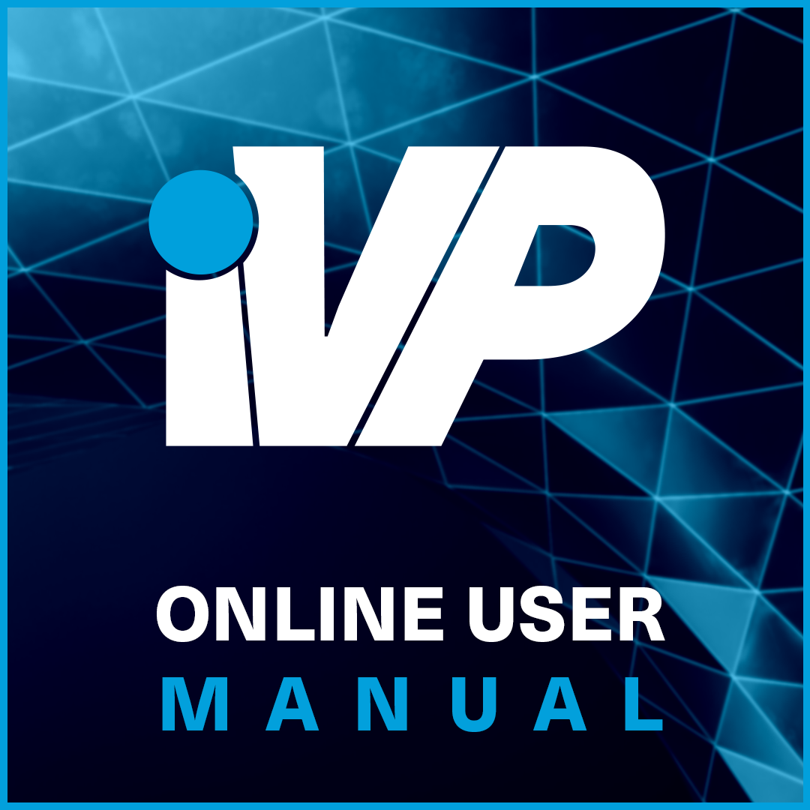

To provide you with a short introduction and overview you will find regular updates and tutorials on the iVP YouTube Channel.


iVP Planning Tutorial Playlist


If you encounter technical problems with your iVP software of any kind please contact our [support team](mailto:support@i-vp.dev).