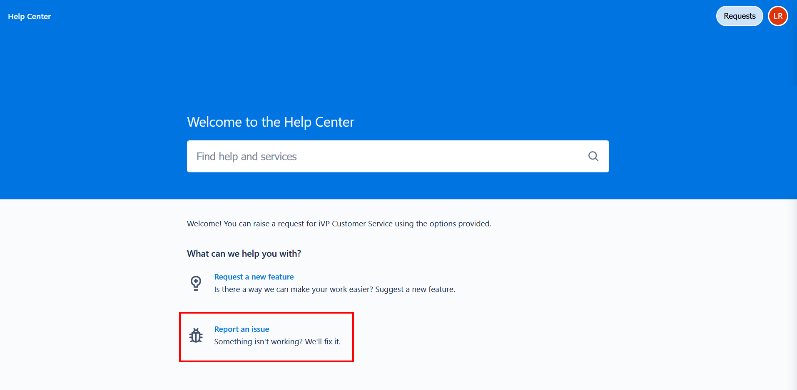

# Creating a Service Entry

Before creating a new entry, you should always check whether another user has already suggested a similar feature or reported the same issue. You can find out how to view existing service entries [here](view-feature-requests.md). 

> **Please notice:**
To use the [iVP Customer Service](README.md), you need to create an account. Every key user received a personal invitation. Please follow the link in the e-mail to complete the registration process.

## Feature Requests
If you want to suggest a new feature or improvement, you can forward your ideas and suggestions for iVP Planning directly to the developers via the 'Request a New Feature' option. 

Select the button and fill in all fields of the request form: 

**Title**   
Give your request a title with recognition value. Use a keyword or a short description (max. 5 words).  

**Description**  
Describe your idea in detail. The more detailed the better! Adding a description is mandatory. 

**Attachment**  
Add graphics, screenshots, or other files to your request to complement the description. Adding attachments is optional. 

**Share with**  
This field specifies with whom you want to share your request. It allows other key users to see your request and avoids duplication.

> **Please notice:** Since your inquiry must be approved by the project owner, always set this field to "Share with iVP Key Users". Otherwise, your request won't be visible.

## Bug Reports
If a bug has occurred in iVP, you can report it directly to the developers. To do so, select the option "Report a Bug" in the iVP Customer Service portal.

> **Not an iVP Key User?** No Problem! You can [report an issue directly from iVP Planning](../ivp-planning/bug-reporting.md).

Afterward, fill out the fields in the report form conscientiously:

**Title**  
Summarise the error in a short description (approx. one sentence). It's mandatory to add a title.

**Description**   
A precise description is essential to solving the problem as quickly as possible. Therefore, document the error in this field in detail. The following information is particularly relevant for our developers:
- Steps to reproduce the error 
- Under what circumstances did the error occur?
- Expected and actual behavior 
Adding a description is mandatory.

**Attachments**   
Add attachments to your report to complement your description. For our developers, are the following files particularly helpful:
- Log files
- Memory files (.PLAN / .HFC)
- Screenshots and videos

**Share with**  
This field specifies with whom you want to share your request. It allows other key users to see your request and avoids duplication.

