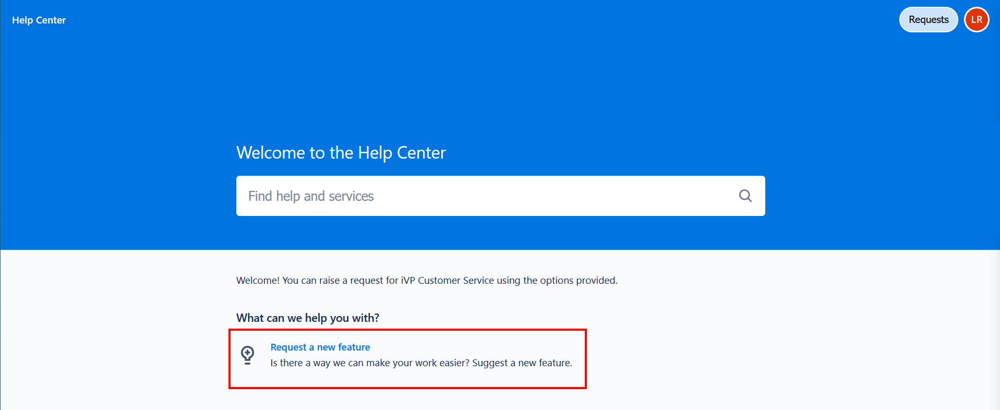

# Creating a Feature Request

## Register for iVP Customer Service
First, you need to sign up for the [iVP Customer Service](README.md). Every key user received a personal invitation. Please follow the link in the e-mail to complete the registration process.

## Creating a feature request
Before creating a new request, you should always check whether another user has already suggested a similar feature. You can find out how to view existing requests [here](view-feature-requests.md). 

If you want to suggest a new feature or improvement, you can forward your ideas and suggestions for iVP Planning directly to the developers via the 'Request a New Feature' option. 

Select the button and fill in all fields of the request form: 

**Title**   
Give your request a title with recognition value. Use a keyword or a short description (max. 5 words).  

**Description**  
Describe your idea in detail. The more detailed the better! Adding a description is mandatory. 

**Attachment**  
Add graphics, screenshots, or other files to your request to complement the description. Adding attachments is optional. 

**Share with**  
This field specifies with whom you want to share your request. It allows other key users to see your request and avoids duplication.

 

> **Please notice:** Since your inquiry must be approved by the project owner, always set this field to "Share with iVP Key Users". Otherwise, your request won't be visible.
