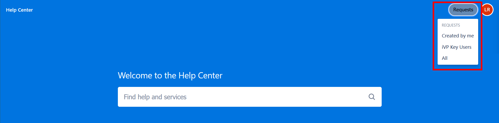
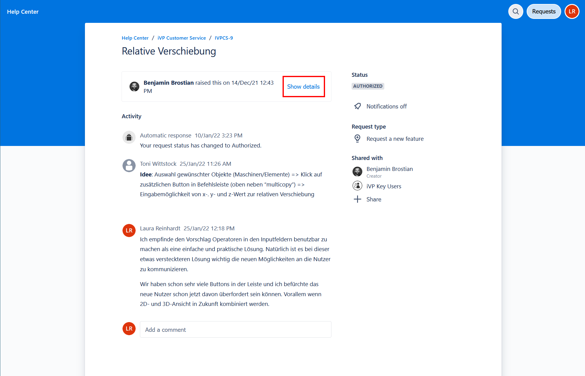

# Viewing Service Entries

## Navigate to the Request List

To view inquiries in the [iVP CUstomer Service](README.md) portal, select the requests button in the top right corner. You can access various lists of inquiries via this button: 

**Created by me**  
Here you will find all your feature requests and bug reports.  

**Approvals**  
This category only appears if you are a project owner. Here you will find all features waiting for your approval. 

**iVP Key User / All**  
Under these entries, you will find all collected requests and reports. 

After the selection, you will get to a list view of the corresponding entries. Here you can also search for inquiries or filter different parameters.  

## View Request Details

With a click on the list item, you can call up the content of the entry. Here you can read the description, view attachments, or read and write comments. If the description and attachments are not immediately displayed, you can show them by clicking on "Show details". 

