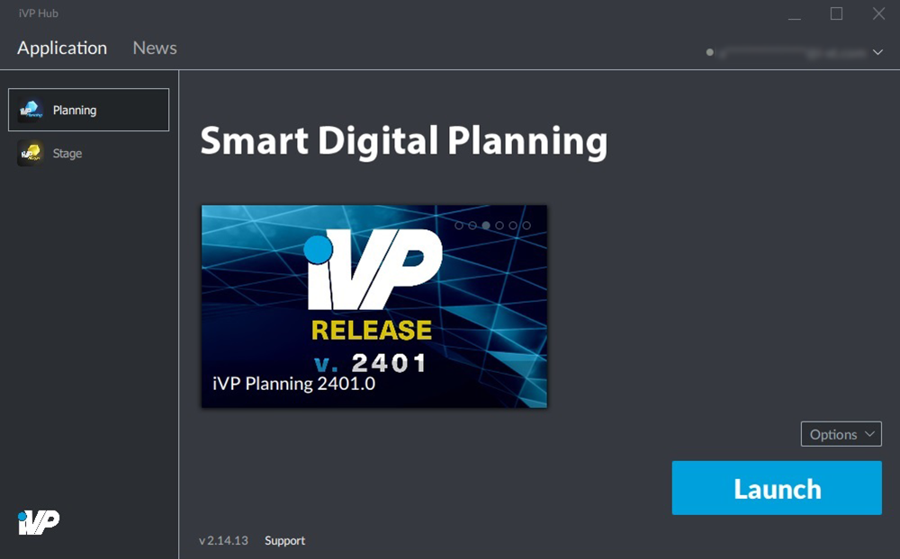

The iVP Hub allows you to manage and maintain your iVP software. You can [install](./application-management/install-applications.md) or [uninstall](./application-management/remove-installations.md) applications, [activate licenses](./application-management/license-activation.md), [update](./application-management/installation-updates.md) your iVP software and [repair](./application-management/repair-installations.md) installations.
Furthermore the iVP Hub offers you a [news feed](./ivp-news.md) to stay informed about new software features and developments.