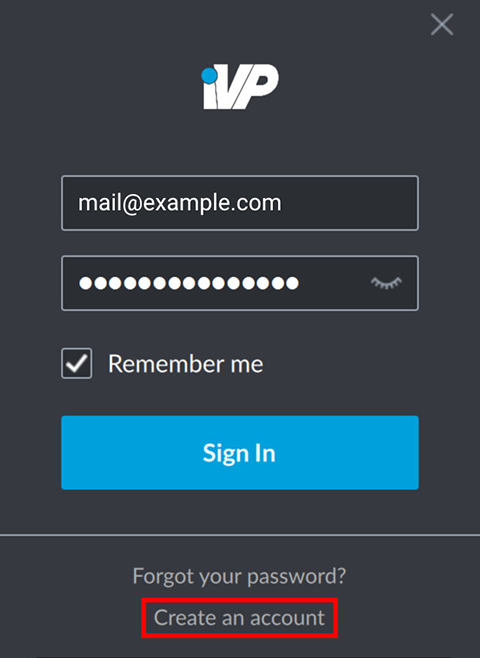
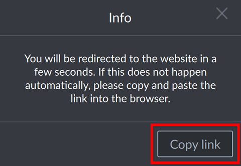
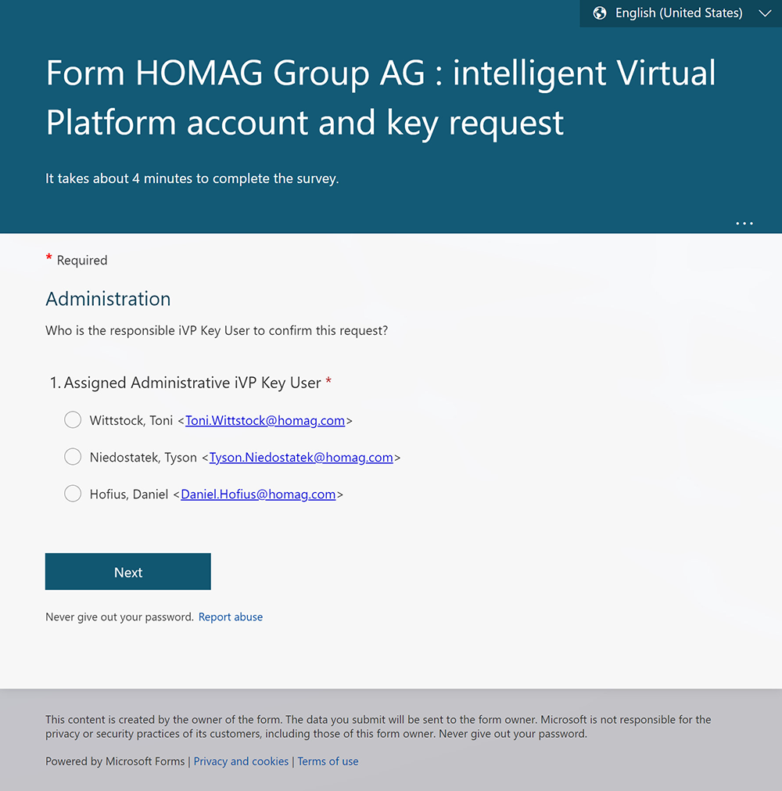
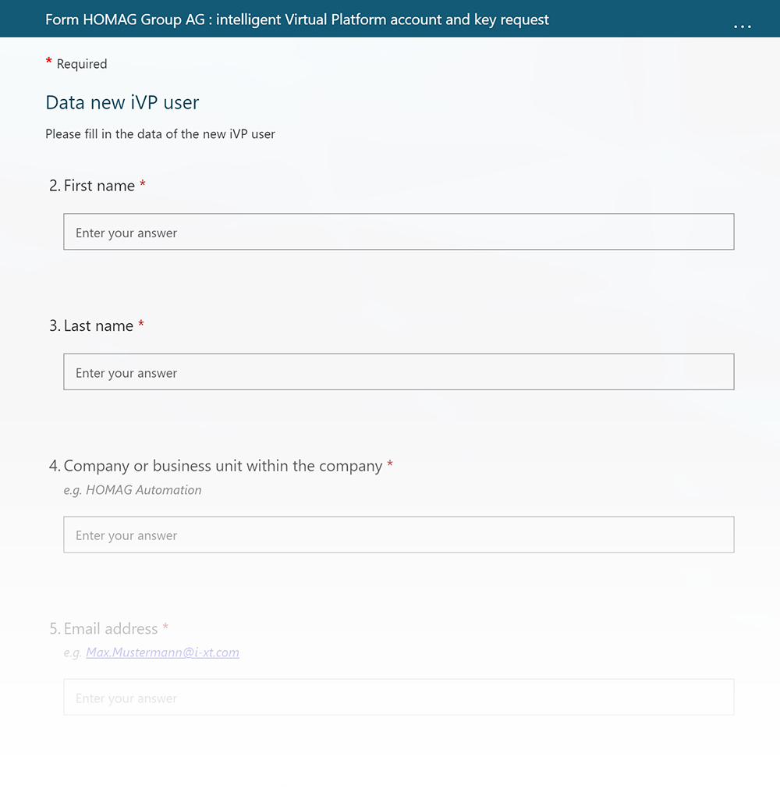

To use the iVP Hub you have to be [logged in](./login.md) with your account. However, if you do not have an account yet you can also create one right from the login window.

## Create an account
After starting the iVP Hub click on the __Create an account__ link at the bottom of the login window.

## Open the link
You will now be forwarded to a web page opened by your default browser. Alternatively or if the link will not be opened automatically you can also click on the __Copy link__ button and open the link manually in a browser of your choice.

## Provide a key user
The web page itself will vary slightly depending on your organization. However it is usually necessary to first state an iVP key user that will manage the iVP accounts of your organization.

## Provide account details
In a second step you have to add some information about yourself or the person that will use the new account.

## Receive login credentials
After finishing the process your request will be forwarded to the iVP key user you stated earlier. If this person accepts your request you will receive an e-mail that contains your new login credentials.


Do not forget to [__change your password__](./reset-account-password.md) after you logged in for the first time to reduce the risk of your account being compromised if someone gets access to the mail with the original credentials.
