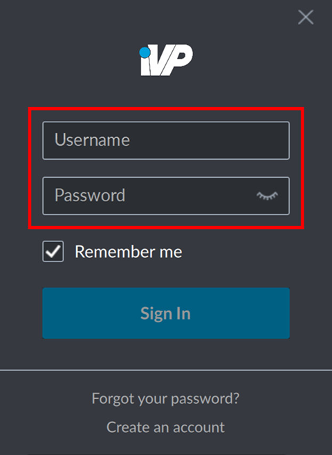
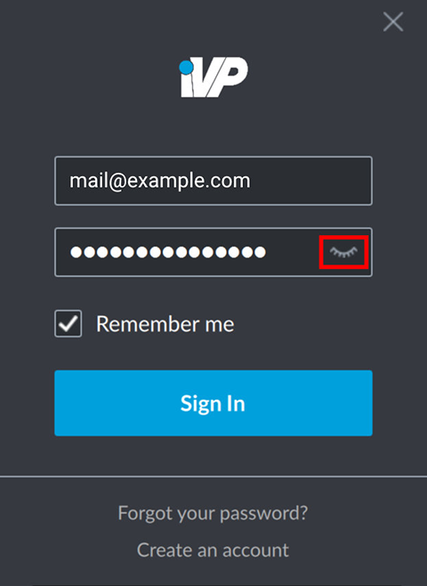
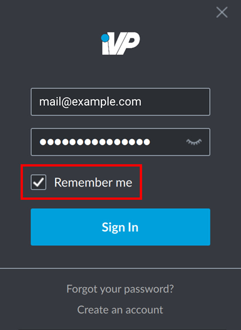
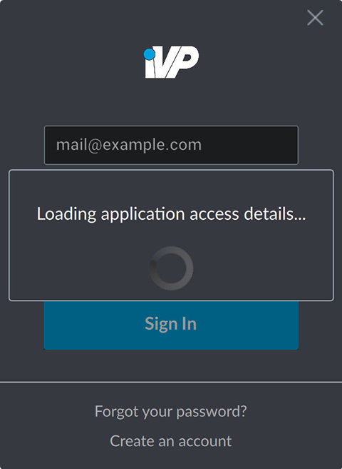

To log into the iVP Hub you need an username (usually your e-mail address) and a password that you will be provided by the iVP key user of your organization. If you do not have an account yet you can [create one](./account-creation.md) directly from the login window.

## Username and password

After starting the hub enter your username and password in the fields of the login window.

## Unhide your password input

If you are not sure whether you typed in the correct password or if you want to check your input you can click on the eyelid symbol on the right side of the password input field. This will make your inserts visible.


Remember that the password will be visible to anyone who can watch your screen, e.g. when you are share your screen during a video conference or remote desktop session.


## Remember me

If you prefer not not login every time you start the iVP Hub you can check the __Remember me__ option so your credentials will be stored locally for more convenient login.

## Sign in

After you entered your credentials and clicked on __Sign In__ the hub will validate your information. This can take a few seconds.

## Ready to go

If your credentials are correct the main window of the iVP Hub will be displayed and you are ready to [install new applications](../application-management/install-applications.md), [update already installed applications](../application-management/installation-updates.md) or have a look at the [iVP news feed](../ivp-news.md).