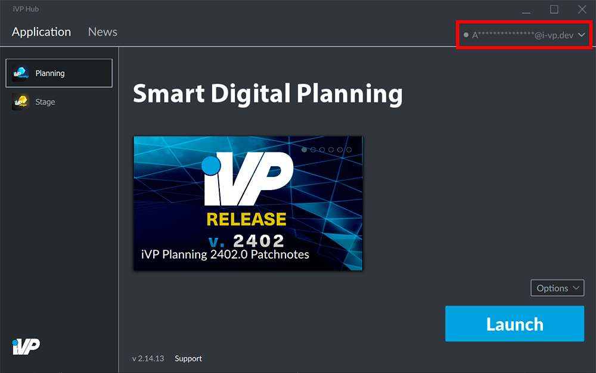
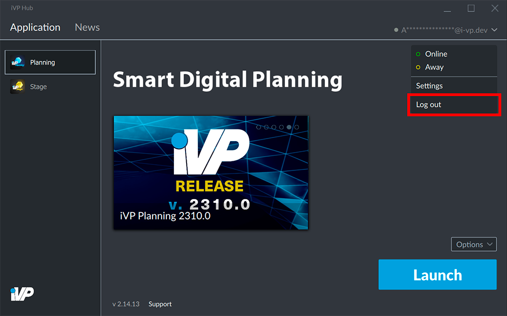

If you share a machine with other people or if you want to [change your password](./reset-account-password.md) you might want to log out of your iVP Hub account.

## Open the account menu

Click on your account name (usually your e-mail address) in the top right corner of the hub window to open the account menu.

## Logout

Inside the accoutn menu click __Log out__.

