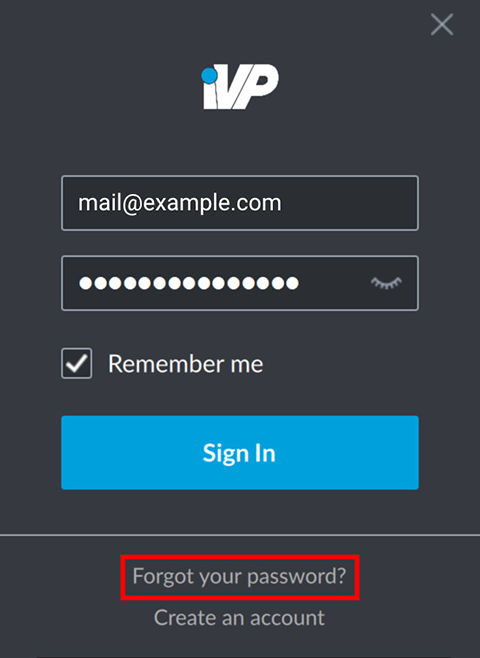
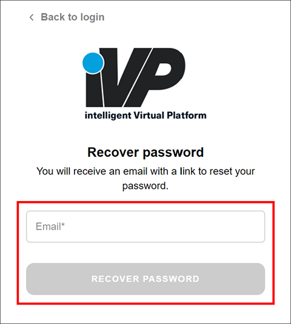
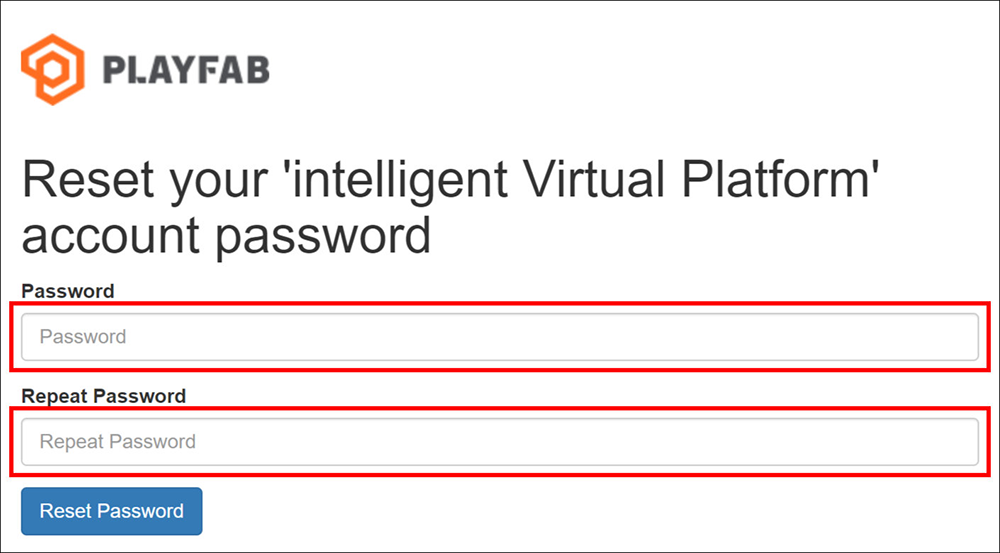
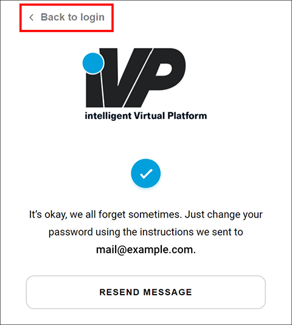

In case you forgot the password for your iVP Hub account or you want to change it, it is possible to request a reset link via your account's e-mail address.


If your [__Remember me__](../settings/remember-me-option.md) option is active you might have to [log out](./logout.md) first to get to the [login window](./login.md).


## Request a password reset

To reset your password start the iVP Hub and wait until the login window appears. At the bottom of the window click the __Forgot your password?__ link.

You will then be forwarded to a web page that will open in the default browser. If the link does not open automatically you can also click on the __Copy link__ button and open the link manually in a browser of your choice.

## Provide your e-mail address and recover your password

In your browser window enter the e-mail address of your iVP Hub account into the field labelled __Email__. Verify there are no typographic errors and click the __RECOVER PASSWORD__ button.

## Check your e-mail inbox and reset your password

You will now receive an e-mail with the subject __intelligent Virtual Platform account recovery__. By clicking on the link in this e-mail you will be forwarded to a web page where you can enter a new password.


If the e-mail does not arrive in your inbox in a couple of minutes you should check your spam folder before clicking the __RESEND MESSAGE__ button.


## Get back to the iVP Hub

After resetting your password you can switch back to the login window of the hub and enter your new credentials by clicking the __Back to login__ button.

