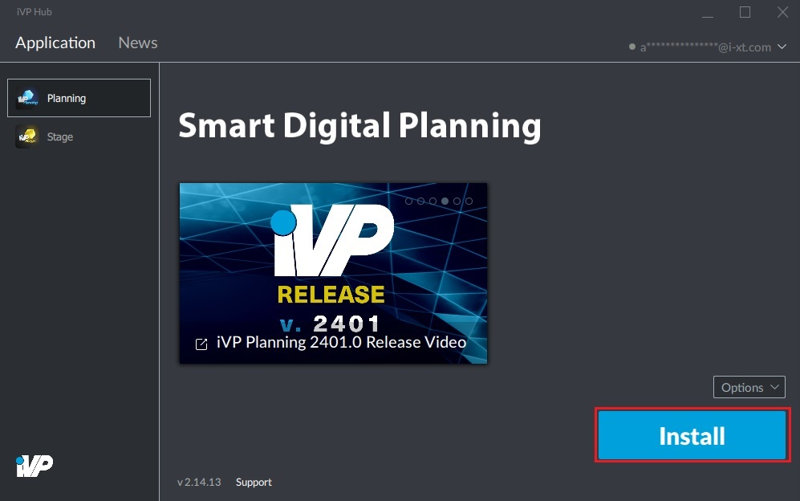

# Install Applications

All iVP applications can be installed and [updated](installation-updates.md) directly from the iVP Hub window in a few steps. However, it is necessary to [activate the license of the particular program](license-activation.md) first.

## Install an application:

**1.** Got to the "Application" tab of the iVP Hub and click on the application you want to install.

**2.** If you already have [activated the application](license-activation.md), click on the "Install" button in the bottom right corner of the window. If a grey "Redeem license" button is visible instead of the "Install" button that means this application was not [activated](license-activation.md) yet.

**3.**  Now you can specify where the application will be installed and if you want to have a link to it in your windows start menu. Then all that is required to start the installation process is to click on the "Install" button.


Although you can choose the installation folder freely, we recommend you to use the default installation path.


**4.** As soon as you started the process, the installation window will close. Moreover, you can now track the download and installation progress in the hub window.

From here, no action is needed. However, it is possible to pause the download if necessary.

