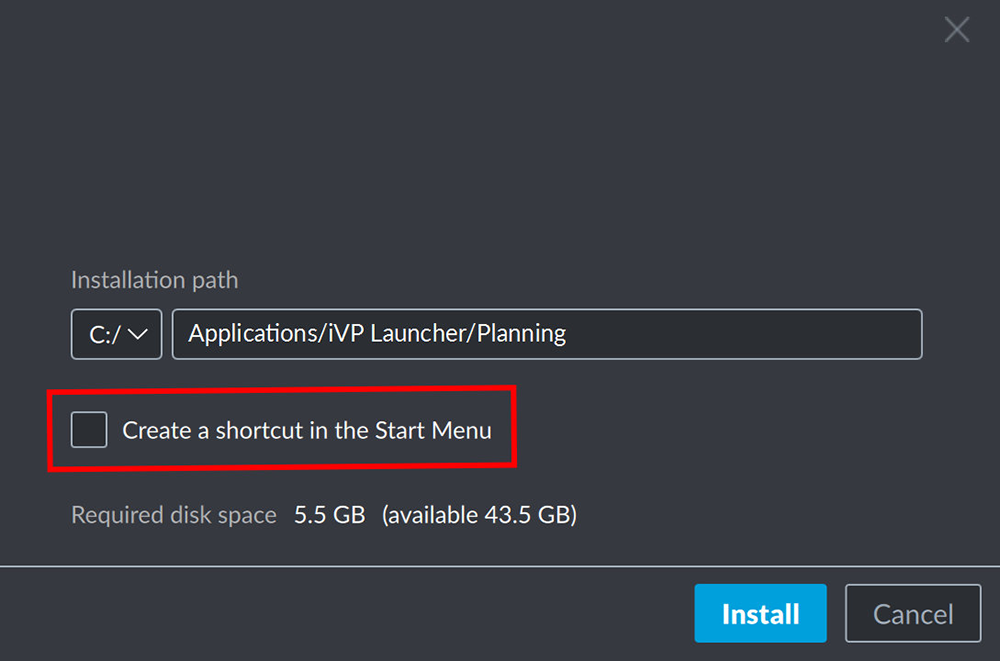

All iVP applications can be installed and [updated](./installation-updates.md) directly from the iVP Hub window in a few steps. Before you can do so make sure to [activate the license of the particular program](./license-activation.md) first.

## Select an application

Got to the __Application__ tab of the iVP Hub and click on the application you want to install.

## Start the installation

To start the installation process click the __Install__ button in the bottom right corner of the window.


If you see a grey __Redeem license__ button instead of the blue __Install__ button it means that this application has not been [activated](./license-activation.md) yet.


## Installation settings

You can then specify where the application will be installed and if you want to have a link to it in your windows start menu. To proceed click the __Install__ button.


Although you can choose the installation folder freely we recommend you to use the default installation path.


## Installation process

As soon as you start the installation process the window will close and you will be back at the iVP Hub main window where you can track the progress of the download and installation process and decide to pause or stop it.

