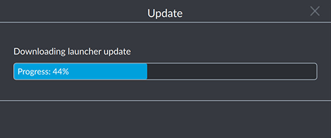
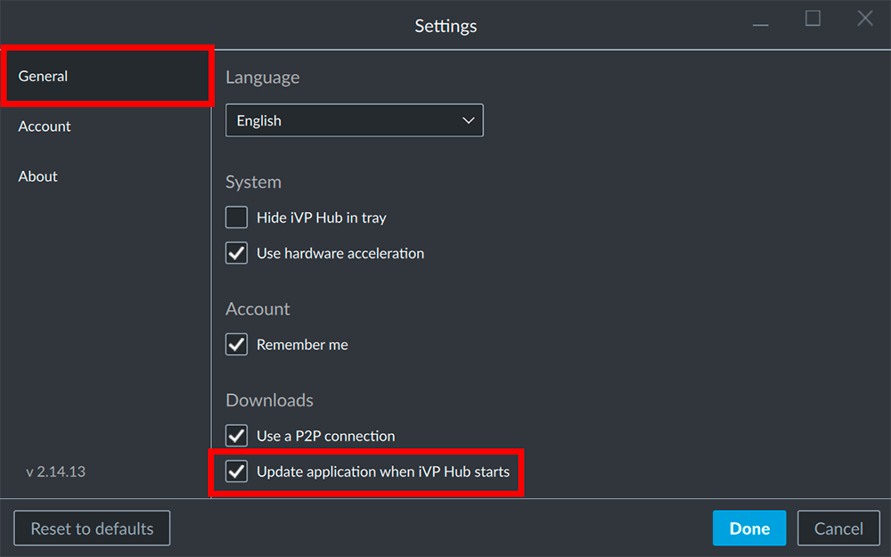

To keep all iVP applications up-to-date the iVP Hub features a build in updater.

## iVP Hub updates

The iVP Hub will be updated automatically as soon as a new version is available. Because of that you might see an update message from time to time when you start the hub.

## iVP application updates

The automated application updates are optional so you can continue to use the application versions currently installed on your computer or tablet. We recommend to enable the automatic updates because this way you will receive new features or bug fixes on a regular basis.

### Open the iVP Hub settings

Open the settings page of the iVP Hub by clicking on your account name (e-mail address) in the top right corner and selecting __Settings__.

### Activate automatic updates

Select the __General__ tab and activate the __Update application when hub starts__ option. To confirm and save your settings click the blue __Done__ button.

