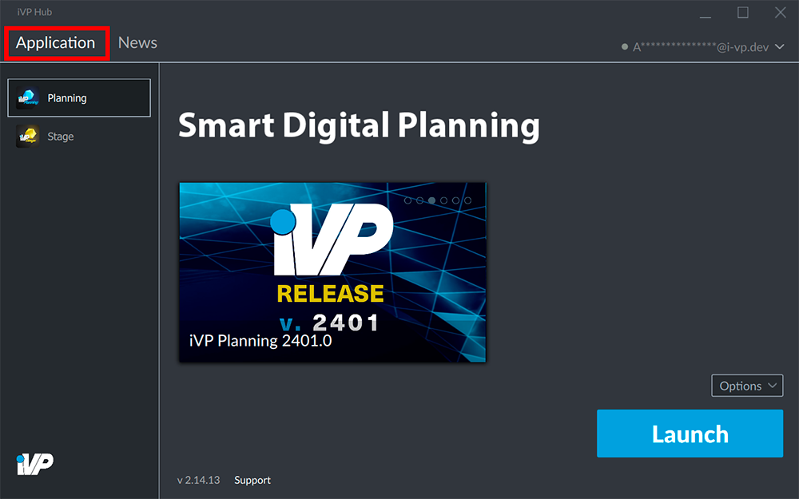
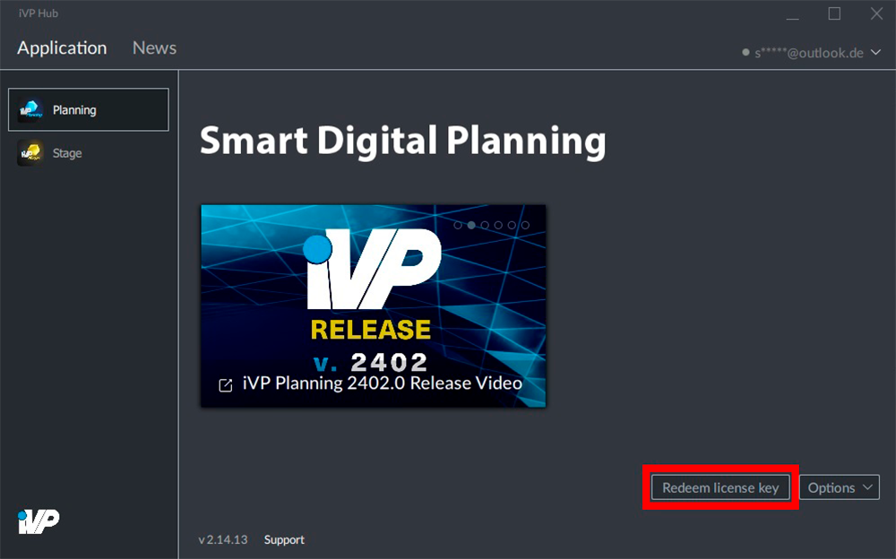
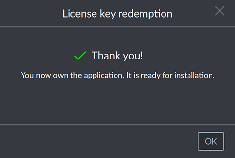

Before you can download an iVP application you will first have to enter a valid key for the particular program.

## Choose your application

In the __Applications__ tab of the iVP Hub choose the application you want to activate on the left side.

## Redeem your license key

To activate your iVP application click the __Redeem license key__ button.

## Enter your license key

A window titled __License key redemption__ will open where you can enter your license key. The structure of the key should look like __88FKH9-E01898-4FE396-47E441-570ACA-3FXB50__.

## Activate your application

To finish the activation process click __Redeem__ button. Now you are ready to [install the application](./install-applications.md).

