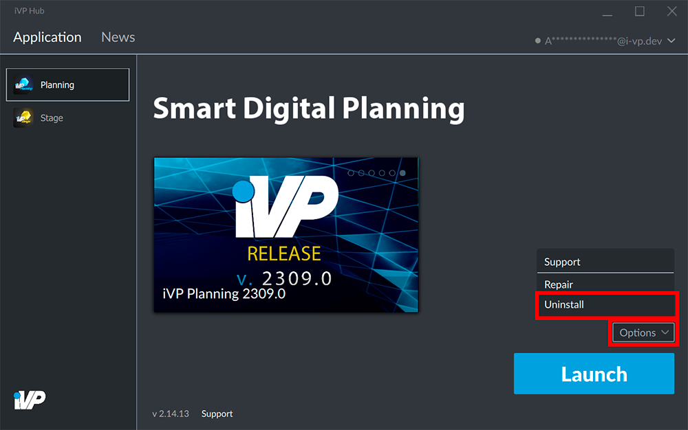

It is possible to remove an iVP application from your computer or tablet at any time.

## Select an application

Open the __Application__ tab of the iVP Hub and click on the application you want to remove.

## Uninstall the application

In the bottom right corner click the grey __Options__ button and choose __Uninstall__ from the options menu. The iVP Hub will then remove the application from your system.

