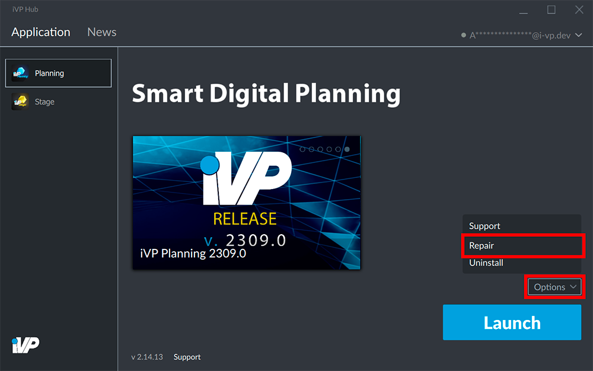
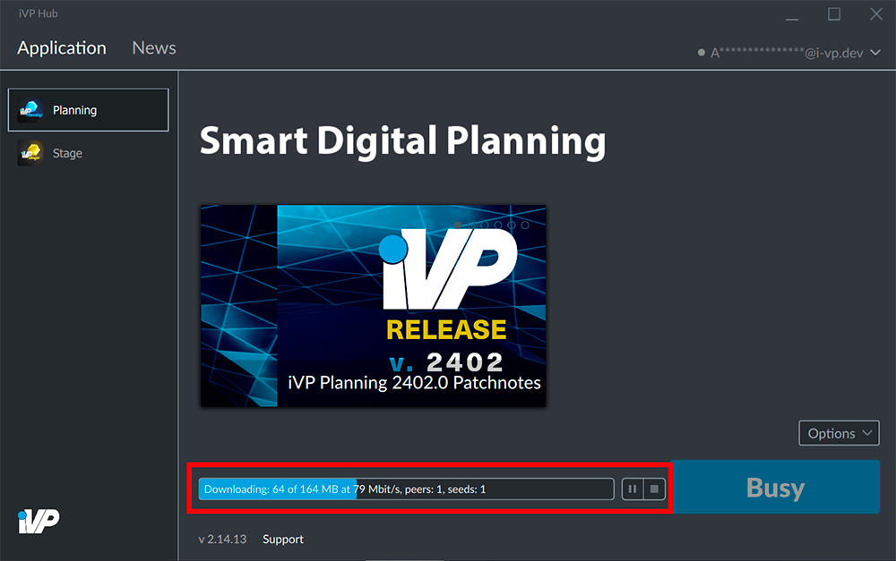

If you repeatedly encounter a serious issue like a crash or freeze of your application it could originate from a corrupted application installation. By repairing an installation you can fix this issue without the need of a re-installation.

## Select an application

Open the __Application__ tab of the iVP Hub and click on the application you want to repair.

## Repair the installation

In the bottom right corner click the grey __Options__ button and choose __Repair__ from the options menu.

The launcher will now check the installation and download or replace some of the program files if necessary. You can track the progress of the process and decide to pause or stop it.

## Restart your application

After the process has finished you should be able to start your application without any problem.


In case the repair process could not solve your problem please reach out to our [support team](mailto:support@i-vp.dev) at any time.
