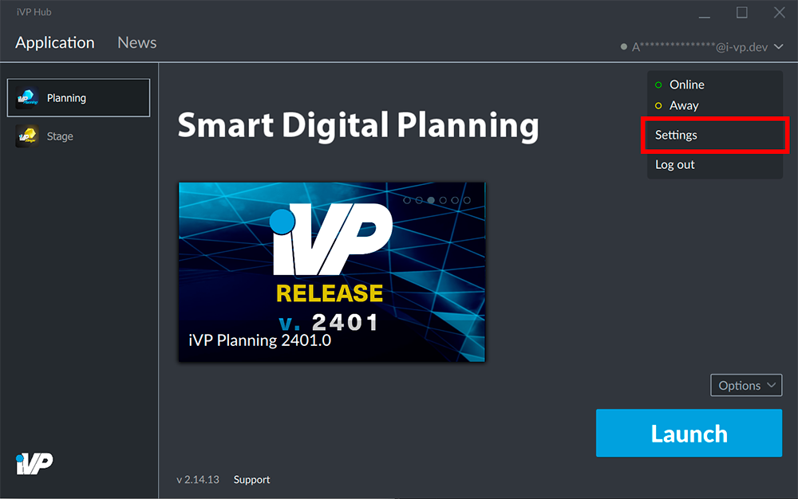

The iVP Hub can be configured in different ways - it is possible to [change the language](./launcher-language.md), [save your login data](./remember-me-option.md) or configure the Hub's behaviour.

## Open the settings

Open the settings panel by clicking on your account name / e-mail address in the top right corner of the window and select the __Settings__.

