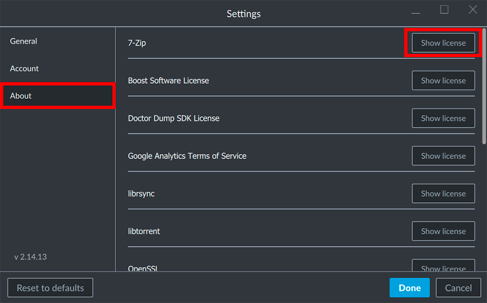

## Open the settings

Open the settings panel by clicking on your account name / e-mail address in the top right corner of the window and select the __Settings__.

## Show a license

Inside the __About__ tab in the left column of the Settings Panel you can find a list of every library or 3rd party software that is used to provide you with the iVP Hub and its services. Click the __Show license__ button next to a library or software you prefer to read the license text of.

