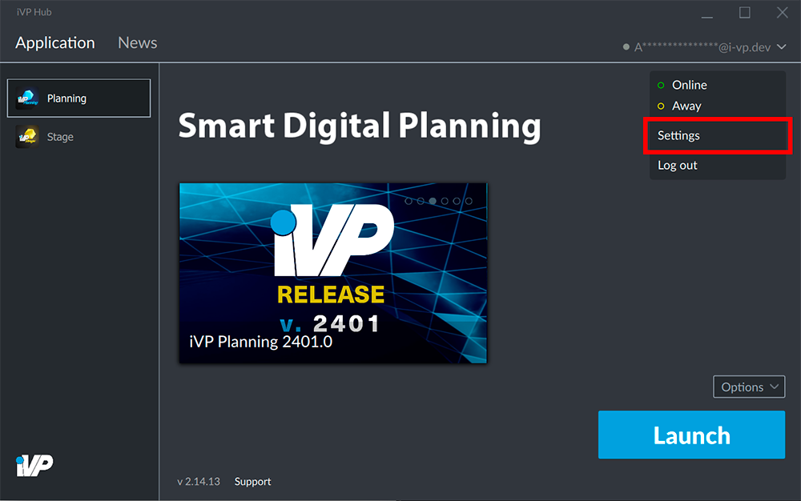
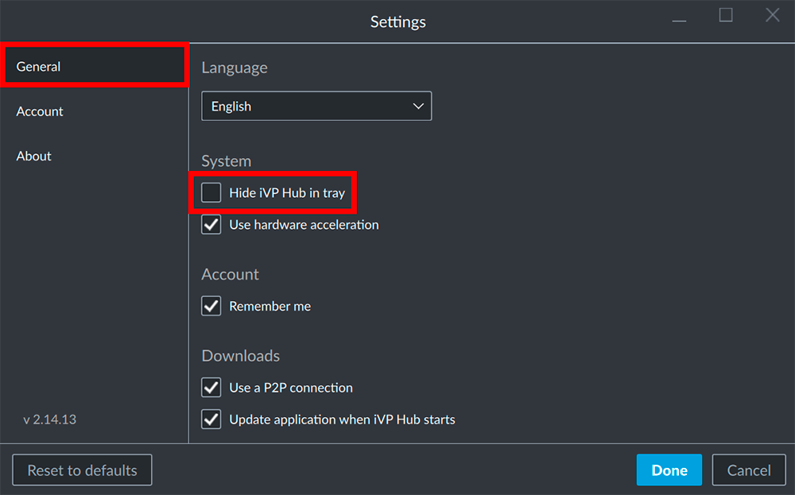

The iVP Hub can be minimized in the Windows System Tray to keep it running in the background without the need to have it opened in the windows taskbar all the time.


The iVP Hub will only be minimized to the System Tray if its window is minimized. If the window is closed it will **not** be minimized to the System Tray.


## Open the settings

Open the settings panel by clicking on your account name / e-mail address in the top right corner of the window and select the __Settings__.

## Hide in System Tray

Inside the __General__ tab in the left column of the Settings Panel you can find the option to hide/unhide the iVP Hub in the System Tray by activating/deactivating the __Hide iVP Hub in tray__ option.

