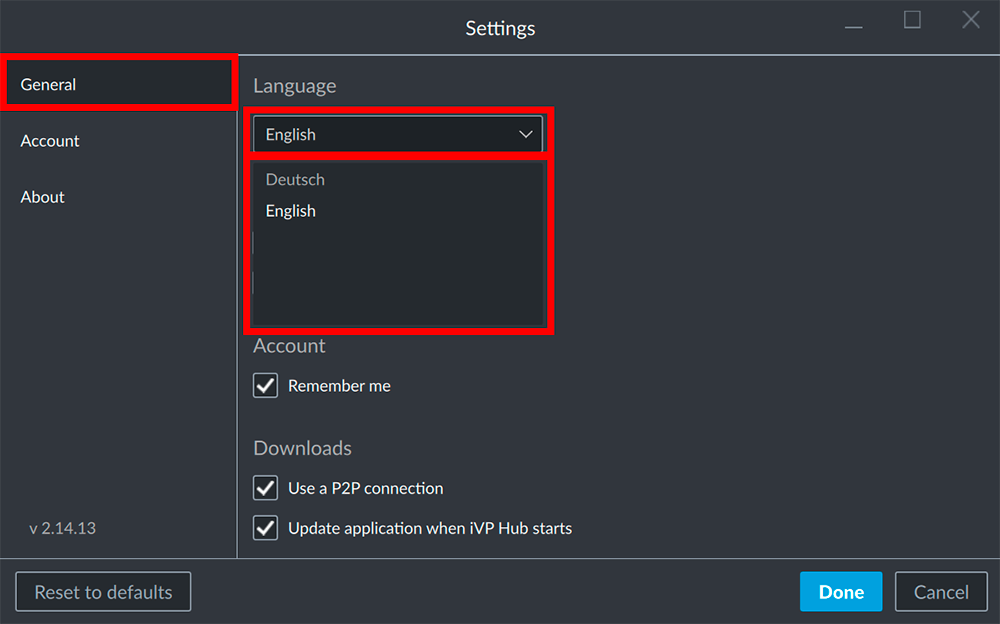

The iVP Hub is available in English and German and it is possible to change the language at any time.

## Open the settings

Open the settings panel by clicking on your account name / e-mail address in the top right corner of the window and select the __Settings__.

## Select your language

Inside the __General__ tab in the left column of the Settings Panel you can find the option to change the language of the iVP Hub at the top. Choose the language you desire by selecting it from the drop-down.

