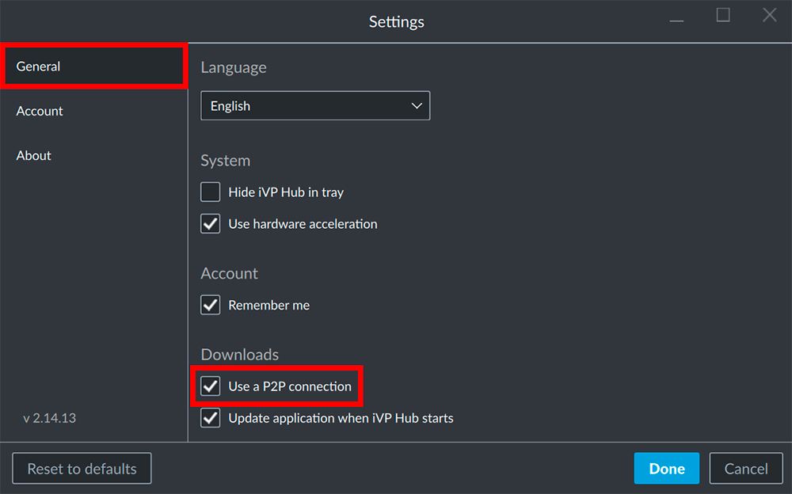

By default the iVP Hub will work as a P2P ("Peer-to-peer") application which obtains its data primarily from other computers in the same network instead of a server. This brings speed and stability advantages but can be disabled if necessary.

## Open the settings

Open the settings panel by clicking on your account name / e-mail address in the top right corner of the window and select the __Settings__.

## Disable the P2P connections

Inside the __General__ tab in the left column of the Settings Panel you can find the option to enable/disable the P2P connections by activating/deactivating the __Use a P2P connection__ option.

