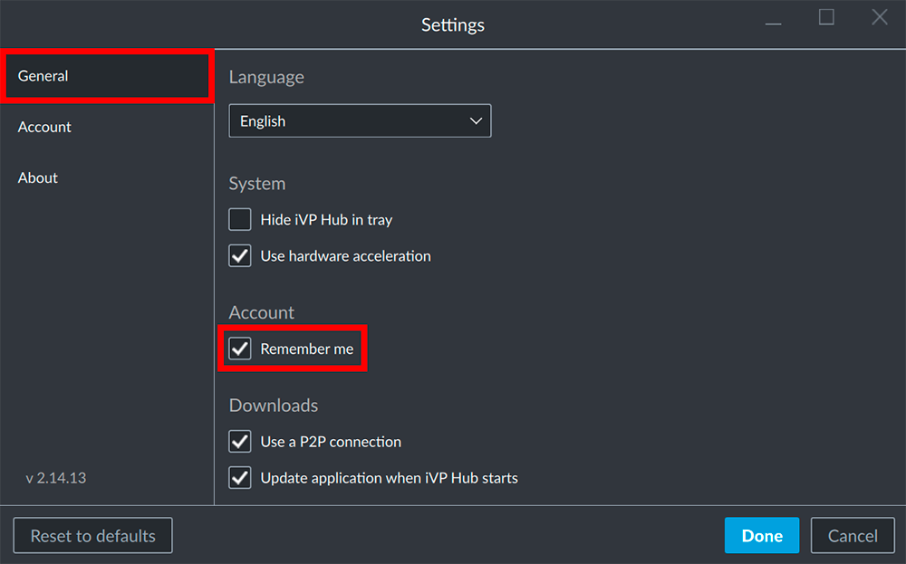

If you activate the __Remember me__ option your login credentials will be saved and you will be logged in automatically when starting the hub.

## Activate Remember me

Start the iVP Hub and check the __Remember me__ option.

## Deactivate Remember me

Since the login window will not be available when __Remember me__ is active you have to access the option via the Settings Panel to deactivate it. You can find the checkbox inside the __General__ tab.

