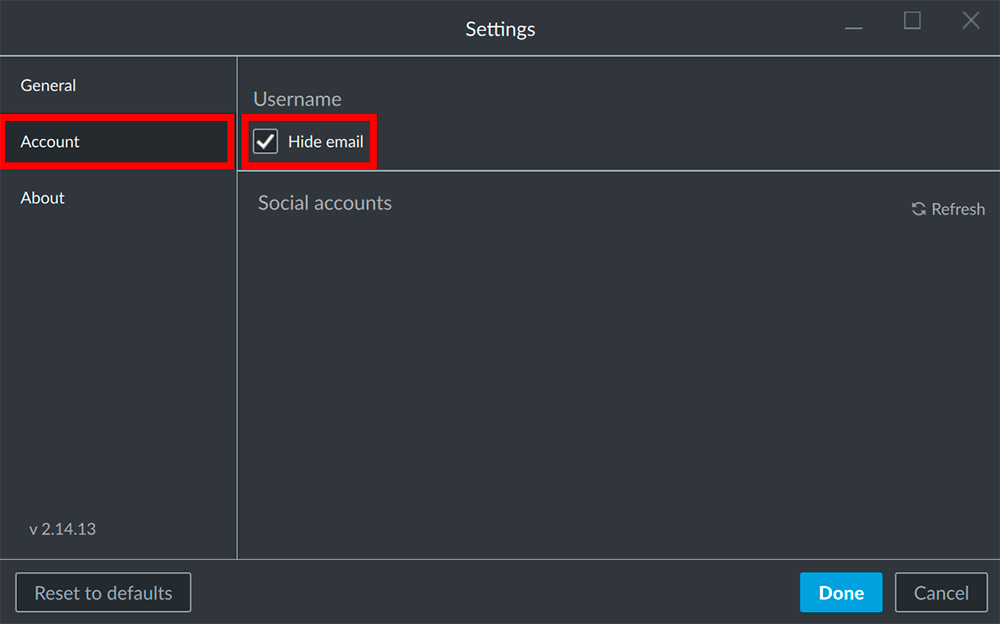

By default parts of the username / account e-mail address are masked with "\*" symbols to enhance security. It is possible however to show the full user name (e.g. if you share your computer with other users that have similar e-mail addresses).

## Open the settings

Open the settings panel by clicking on your account name / e-mail address in the top right corner of the window and select the __Settings__.

## Hide/Unhide your username

Inside the __Account__ tab in the left column of the Settings Panel you can find the option to hide/unhide your user name by activating/deactivating the __Hide email__ option.

