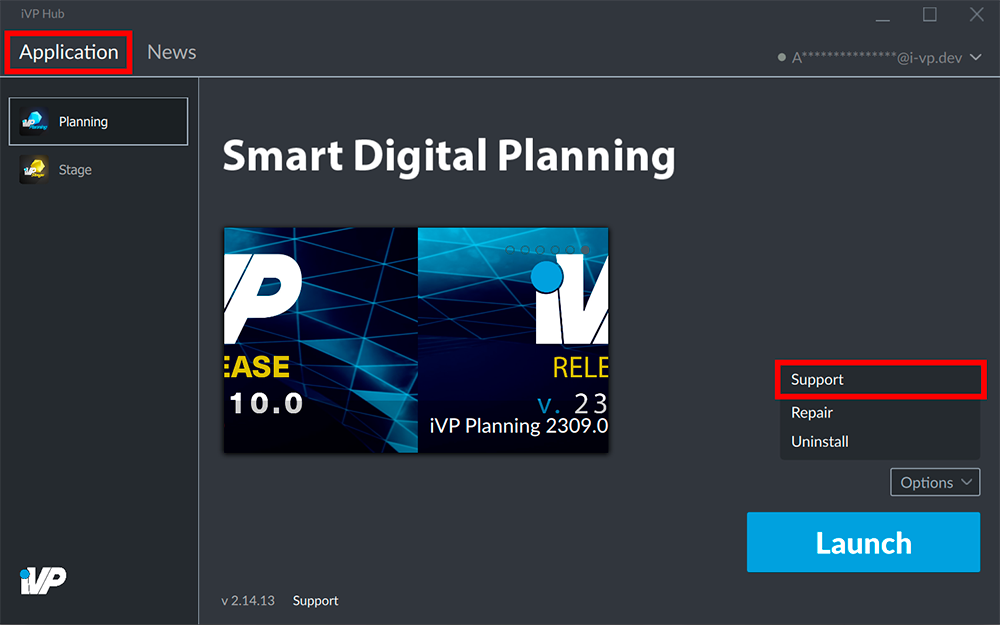

It is possible to open the __iVP Helpdesk__ directly out of the iVP Hub interface.

## Open the Hub

Open the __Application__ tab of the iVP Hub.

 
## Open the iVP Helpdesk

In the bottom right corner click the grey __Options__ button and choose __Support__ from the options menu.

