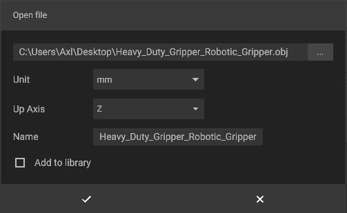
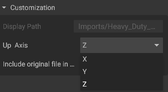

# 3D-Import

To import a 3D file from your personal computer into iVP Planning, simply click on the "File" dropdown menu on the upper left side of the client, and select "Import".  

Currently iVP-Planning supports the following file types: jpeg, png, .fbx, .obj, .glb, .gltf, .stl, .ply & .3mf.  

  
For the best results, we recommend files in the [glTF](https://en.wikipedia.org/wiki/GlTF) format, which have the **.gltf** or **.glb** extension.  


Once you have selected a file, you get the option to define the files Unit of measurement (mm,, cm, dm, m, ft), and the direction of the Up Axis of the object.

Please note that the Up Axis of the imported object/file must match with the Up Axis you have chosen when exporting the object/file, i.E. Z, X or Y axis.

  

If you  select the wrong Axis Up option by mistake, you have the option to change it via the properties window on the right side, when highlighting the imported object/file.

