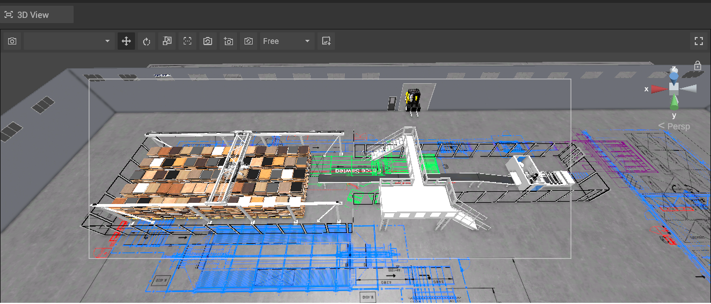

# Box Selection 3D  

Box selection has been added for the 3D pannel, to make it easier to manage your 3D objects.  
Simply hold the CTRL button on your keyboard and drag your mouse over the objects you want to highlight and/or move around.

  

Once you have highlighted multiple  objects, the properties window on the right side of the program will change to the _Multiple Values_ window.

