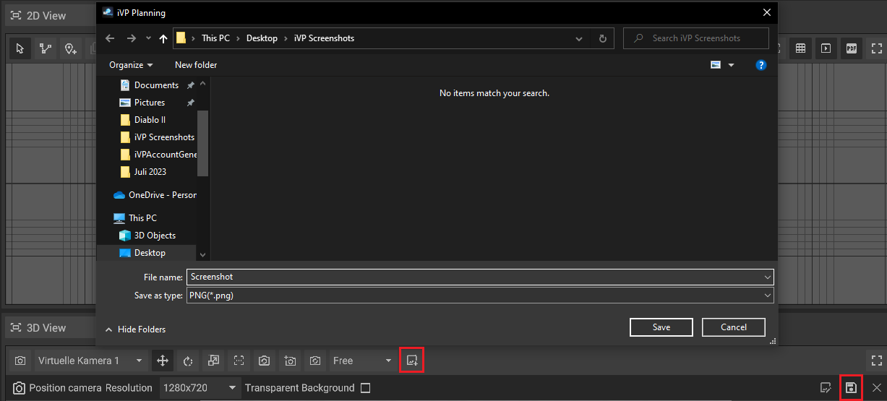
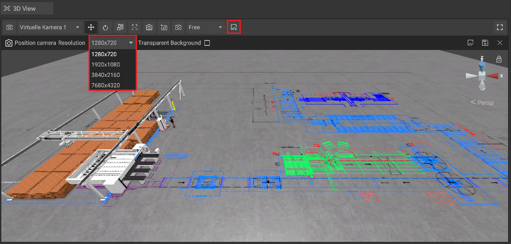
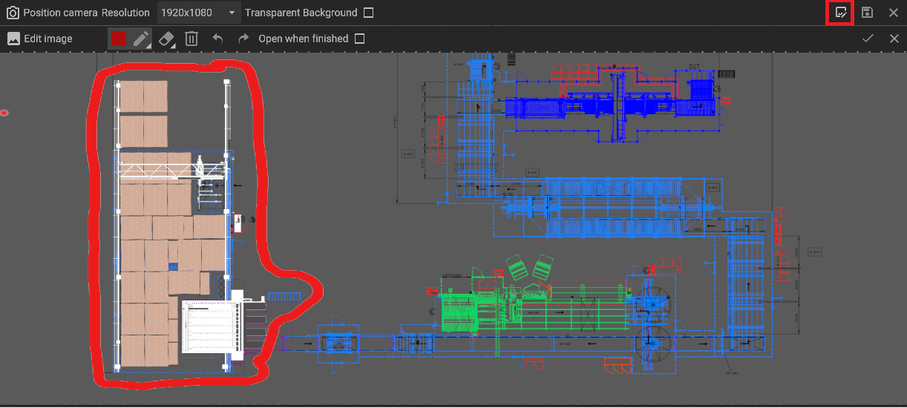
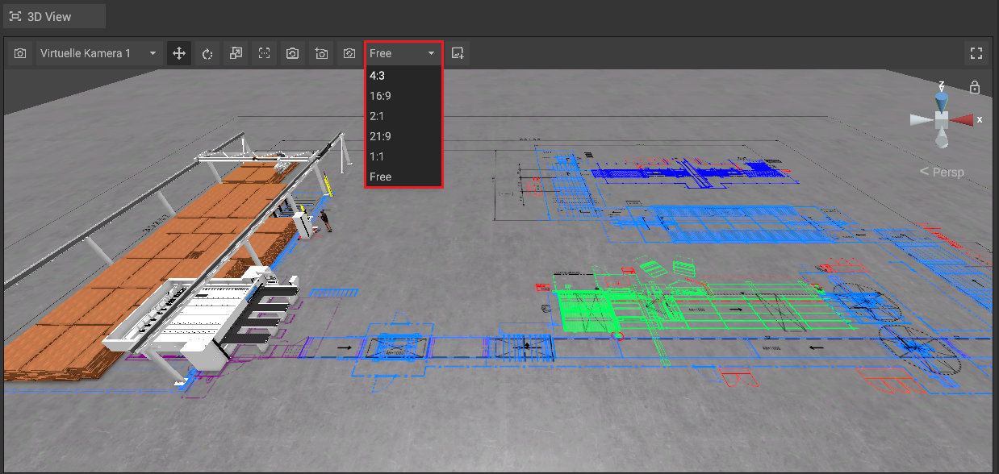
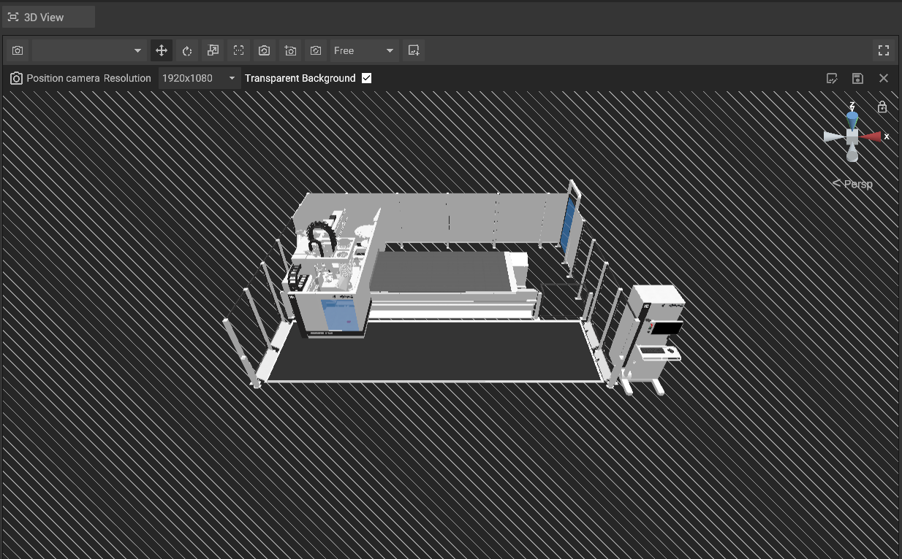
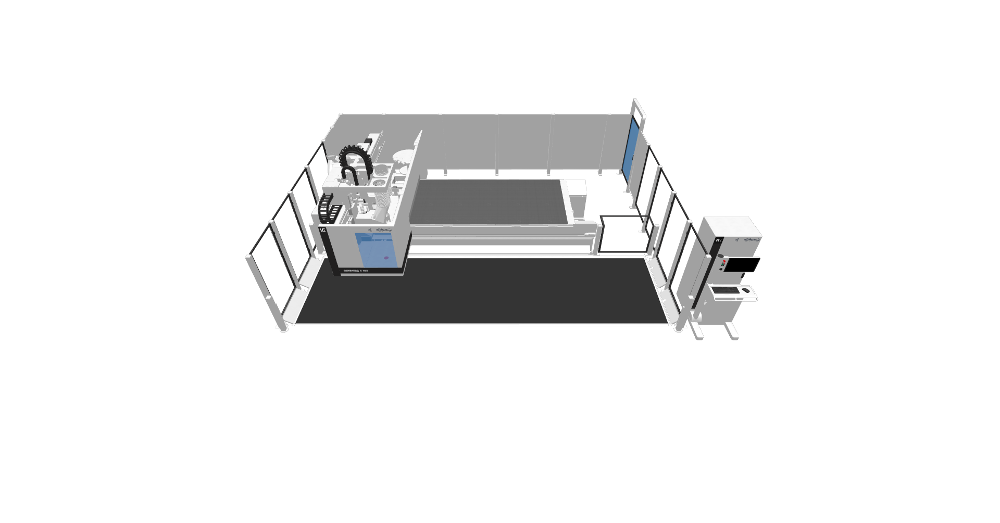

# Creating Screenshots
  
It is possible to save the current content of the 3D- or 2D-Panel as a screenshot. To do so, first click the Screenshot-Button in either panel.  
A new window will open, in which you will be prompted to name your screenshot.

  

## Changing the Screenshot Resolution

Before saving your screenshot, you have the option to change your screenshots resolution. Options range from 1280x720 to 7680x4320.

## Marker- and Eraser-Tools

Before saving your sreenshot, you also have the option to use the marker-tool to highlight any given object inside the 3D- or 2D-Panel. To do so, click on the "Annotate" button highlighted below.  
To erase any unwanted markings, you can use either the Eraser- or Clear-Tools.

## Changing the Aspect Ratio of your Screenshot

You can change the aspect ratio of your screenshot by clicking on the "Aspect ratio" button, to reveal a dropdown menu.  

## Transparent Background

You have the option to create a screenshot without any background noises, by clicking on the "Transparent Background" option.  
A screenshot with a transparent background will have a clear cut of your chosen machine or object.

   
