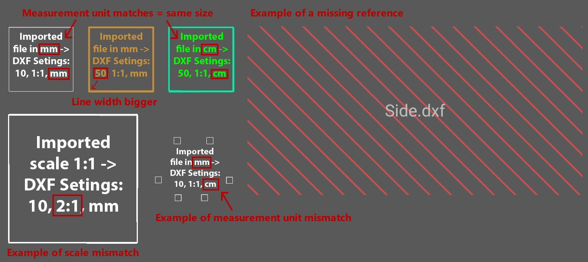

# DXF Files

In iVP it is possible to import and export DXF files, that will be added to the [hierarchy](../user-interface/the-machine-list.md) and can be [edited](../machines/selecting-and-moving-objects.md) as any other object. 

As DXF files are a simplified 2d visualisation of 3d models they can be useful for illustrating a planned layout.


A different usecase would be an [imported PDF](../getting-started/importing-pdfs.md), which will not be moveable in iVP but can be used as a overlay for the [floor plan](../user-interface/the-floor-plan.md).



For better understanding and training we created a [!(../../../.gitbook/assets/YouTube\_icon.png)  YouTube Tutorial Video](https://www.youtube.com/watch?v=Maxivv824Dk&list=PLlzoGkRUR67houzn5F5ejD3R-kQrDcps5&index=18), where you can find a detailed tutorial for the import and export of DXF files.
  // Video TBD



## Import DXF File:

To import a DXF click on **File -> DXF -> Import DXF**. A new window will open that allows you to navigate to the folder that contains the DXF file you want to import.

As soon as you found the file, simply double click or it or select it and click **Open**.

Before iVP actually processes a DXF file and imports it, you will be asked to set some parameters that specify how it will be loaded. The options are:

* _**References**_** this toggle defines wether or not you integrade the dxf file into the project file or not. If unchecked, 
* _**Scale:**_ this value represents the scale of the DXF to import, e.g. 1:100 or 1:50
* _**Unit**_ if checked the size of the floor plan will be adjusted to be equal to the dimensions of the imported PDF


Note that the scale and the measurement unit for imported files refer to the scale/unit the DXF file was planned in and not the scale you want to use in your iVP project.


## DXF Export

asdasda

## Typical errors
Although iVP can process most DXF files and versions, some issues might arise. 
### Old DXF versions
unfortunately it is not possible to process all existing DXF versions to work with iVP. This might be, because the program used to create the DXF file uses an really old standard (1995 or older).
### Text support 
Not all fonts are supported for DXF Import. Also some forms of alignments (vertical text, justificated text, e.g.) can not be converted and might be imported incorrectly. A workaround is to import without text and use our text object to add text information.
### Round Contures
Round contures might be imported incomplete or fractured, as the import utilizes only lines and therefore might break up a round conture.  


## Export DXF File:


[Colored Objects](../machines/highlighting-objects.md) will be colored in the export file too.

