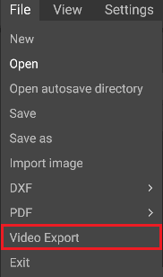
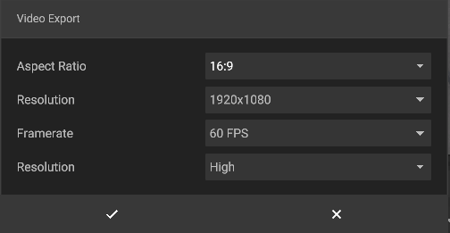

# Video Export
  
It is possible to directly export your recordings via the "Video Export" option, found in the "File" drop-down menu in the top left of the application.

  

Click on "Video Export" to open a new window that allows you to configure your recording.
When ypou click on the checkmark the program will start recording your video, and save it in the iVP-recordings folder.

  