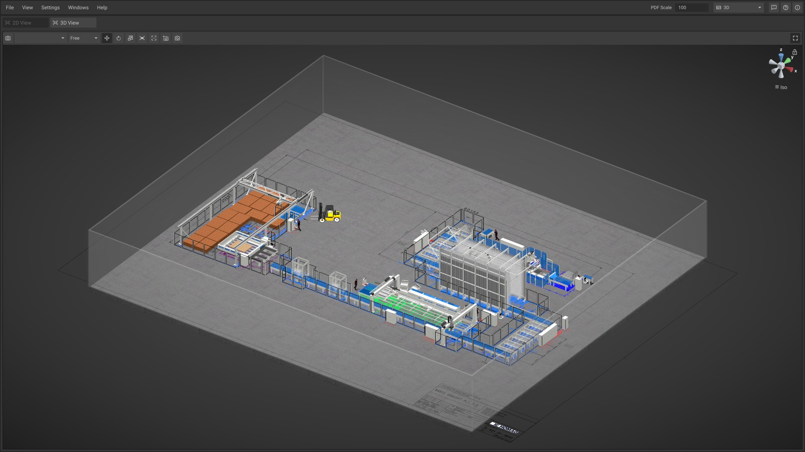

# Version 2201

## Version 2201.0 - 2022-01-28

### Added

* Tag search in the machine library
* Hierarchy: Objects now move, rotate, scale, lock and hide with their parent
* Implemented a new save file format: saving and loading is now faster and more robust (old save files can still be loaded)
* Added an option to open the auto save folder from within iVP

### Changed

* Reworked user interface
  * Improved visual appearance
  * Improved usability of docking panels
* Improved object scaling workflow
  * Objects can now also be scaled from the customization panel
  * Objects can now also be scaled on the z-axis
* Rearranged the library according to your suggestions
* Improved 3D view camera navigation
  * Added a navigation gizmo, that allows viewing your plan from an axis aligned perspective and in an isometric view
  * Added panning
  * Added zooming
* Reduced application startup time

### Fixed

* Performance improvements for machines in the Schuler library
* Various other bugfixes and performance improvements

## Version 2201.0.1 - 2022-02-04

### Changed

* Reduced application size
* Reintroduced the reset camera position button in the 3D view

### Fixed

* Scale/Mirroring is not applied when loading a save file
* Some CNC machines are not correctly loaded from legacy save files
* Some CNC machine's customizations have wrong translations
* The grid in the 2D view does not update correctly when zooming
* The documentation can not be opened via Help > Documentation
* Machines can not be placed inside a path
* Pressing the confirm button when saving does not actually save the plan
* Robot (with linear axis) changes it's position when it's mirrored
* Locked machines are not visible in the 2D view when overhead view is enabled