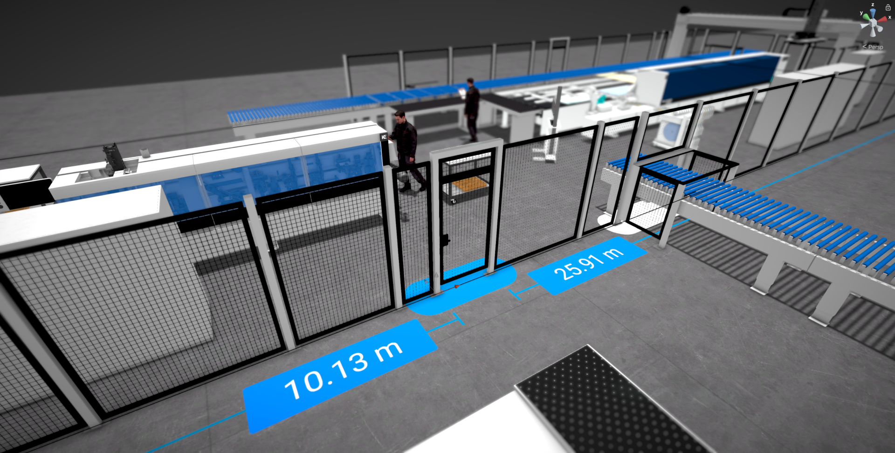

# Version 2203

## Version 2203.0 - 2022-04-06

### Added

* Paths are now displayed in the hierarchy instead of a separate panel
* Path transform and customizations are now displayed in the properties panel
* Paths can now be selected like machines
* Ability to copy/paste paths
* Paths can now be parented
* Paths can now be hidden
* Paths can now be locked
* Paths can now be scaled
* Path label font size is now customizable
* Path modules can now be selected and customized:
    * All modules
        * Type
        * Anchor
        * Position
        * Width
    * Door in fence
        * Model (swinging or sliding door)
    * Passthrough in fence
        * Upper edge height
        * Fence below on/off
        * Lower edge height
        * Finger protection on/off
        * Finger protection depth
    * Door in room
        * Height
    * Passthrough in room
        * Upper edge height
        * Lower edge height
    * Window in room
        * Upper edge height
        * Lower edge height
* Added customizable fence module in fences
* Added Window module in rooms
* Added Lightbarrier module in fences
* Paths can now be drawn in 3D view
* Path labels are now visible in 3D view
* Path name labels can now be hidden
* Text objects and geometric bodies now have dedicated icons in the hierarchy
* Added a warning message when an object is scaled

### Changed

* Path modules can now be placed everywhere on an edge instead of only next to a point
* Path modules can now be moved on their edge
* Path points dragged onto other path points are no longer removed
* Improved path's visual appearance
* Context menus now also work in 3D view
* When a path is a marking, the area is now enabled by default
* Increased 3D gizmo size
* Updated database tags
* Smart Hardware Set tablet display can now be customized and defaults to cutting plan
* When multi copying a single object, the target position of the copies now take the object's rotation into account

### Fixed

* Scrollbars now correctly enforce a minimal height
* Paths now show the correct visibility state when loaded
* When inserting a point into a path, the new point is now always exactly on the line
* When renaming a virtual camera in the camera list, it now correctly updates it's name in the hierarchy aswell
* Selected objects now move into the correct direction when their parent is rotated and moved with them
* Various minor bugfixes

## Version 2203.0.1 - 2022-04-13

### Fixed

* Copying and resizing a THK 500 or solid wood hall no longer breaks the 2D selection UI
* The scale of folders is now applied correctly when resized in the 3D view
* The size of the Bounding Box of the Load Carrier (Universal) now has the correct size in 2D view
* Moving an object on one axis when all it's children are selected aswell does no longer sometimes move it in the wrong direction
* Machines can no longer be accidentally moved when clicking certain screen positions when 2D & 3D view are tabs of the same panel
* It's not possible anymore to accidentally select objects while rotating around an object
* Camera speed setttings work again
* Passthrough modules in fences & rooms now update their displayed upper edge height correctly when the fence/room height is changed
* Labels of paths with only 2 points can be disabled again

## Version 2203.0.2 - 2022-04-21

### Changed

* While drawing a path only the last edge label is visible, so the UI is less cluttered

### Fixed

* Universal Load Carrier can once again be copied
* Objects with child folders can once again be copied
* Objects with multiple virtual cameras as children can once again be copied
* Area labels of paths now correctly show "invalid" when the area is invalid and the label was toggled off and on again
* Path drawing is no longer unexpectedly ended when clicking close to but not on the last point