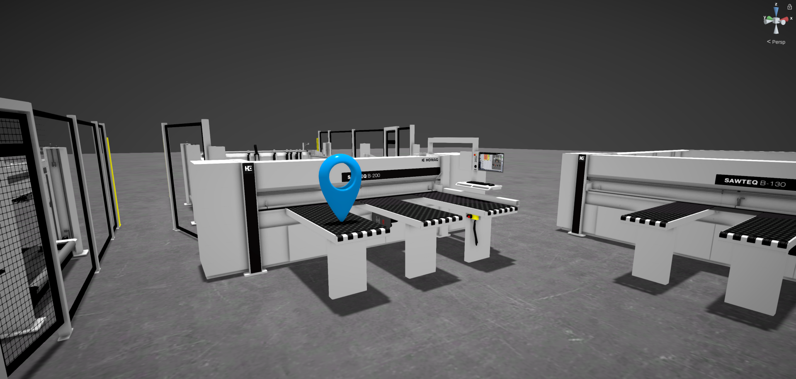

# Version 2209

## Version 2209.0 - 2022-09-22

### Added

* Markup tool

### Changed

* In the 2D view, zoom speed is now dependent on the distance to the floor (you zoom slower when you're already close to the floor)
* Belt conveyor (TFB 100) now has a raster for it's working width
* Removed offline changelog & open source license panel in favor of web version

### Fixed

* Panning in the 2D and 3D orthographic view now moves you exactly by the amount you'd expect
* SAWTEQ B-200 power concept is no longer missing
* SAWTEQ B-200 lifting table variants is no longer missing
* SAWTEQ B-300 micro inserts are no longer missing
* SAWTEQ B-130/180/200 label printers do now show the right model
* SAWTEQ B-200 module45 dependencies are now working correctly
* Switching language doesn't fail anymore under certain conditions
* DRILLTEQ L-200 does not show the wrong customization in 2D view when loaded from a save file anymore
* Loading a mirrored SORTEQ R-200 from a save file now works as expected
* Box selection (2D view) now also affects objects beneath the floor
* Resizing mirrored objects using the handles in the 2D view no longer moves the object to the wrong position
* Dragging on labels of input fields in the properties window now applies the modified values
* Path distance labels are now longer clipping into the floor
* When duplicating a SORTEQ R-200 and modifiying the duplicate, the originals rods no longer disappear
* Renaming machines from the properties window once again works
* The bug reporting panel once again highlights empty mandatory fields when trying to send an invalid report
* Various minor fixes on machines

## Version 2209.1 - 2022-10-18

### Added

* New customization _Transport_ in measure station

### Changed

* Replaced SAWTEQ B-300 Robin with new SAWTEQ B-300 FlexTec (HPX 300) with many new customizations
* Display terminal without gallow when only one module is enabled in switch cabinet
* Removed deprecated version of belt conveyor TFB-261

### Fixed

* Modifying values of input fields in the customization panel no longer sometimes results in wrong values
* The tag search once again displays the correct text for 'Filter by tag'
* The scale of the 3D-volume scanner is now correct
* The WALLTEQ M-310 is now correctly moved to it's rails when the rail length changes while animated
* The PDF information of the SAWTEQ B-300 no longer clips into the floor
* When switching language, the toggles displaying the currently selected language do now always update
