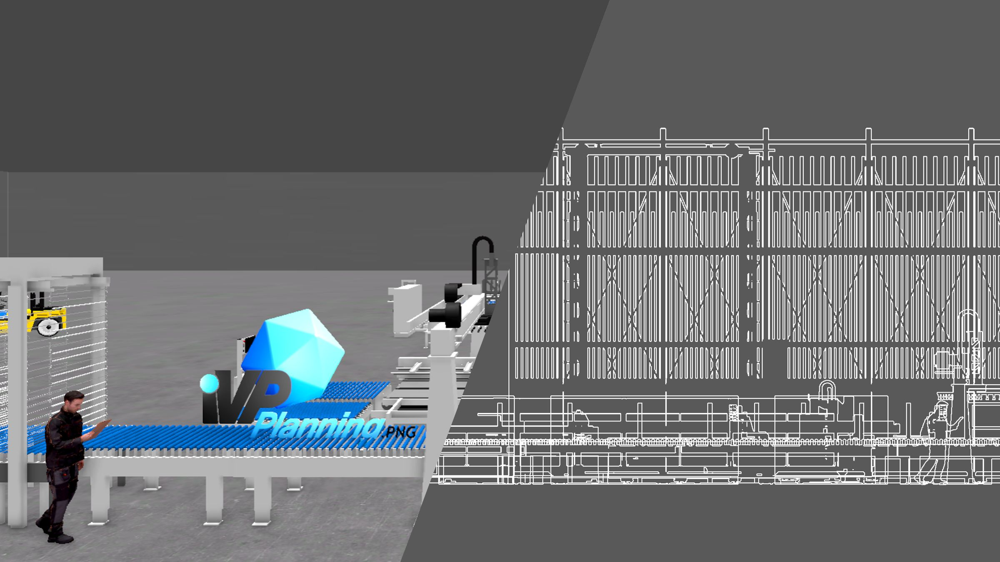

# Version 2302

## Version 2302.0
_2023-02-09_

### Added

* User management
    * Sign in with Microsoft Azure Account
    * Ability to restrict features to specific user groups
    * Ability to restrict objects in the library to specific user groups
    * Replaces the license management using a license key
* DXF Import/Export (restricted to specific user groups)
* Image import (restricted to specific user groups)
* Many new non-branded assets (restricted to specific user groups)
* Added color presets to the color selection (restricted to specific user groups)
* New units centimeter & decimeter

### Changed

* When overwriting a save file, no data is modified when saving fails
* Added a new customization _Light Barrier Field_ to the light barrier
* In the color picker, colors can now also be entered via the input fields (as RGB or HSV)
* The color pickers color profile button now shows the currently selected color profile
* Objects can now also be renamed by double clicking their entry in the hierarchy
* The warning message in the properties panel that is displayed when an object is scaled now has a button to reset the scale
* The column now has a default size of 500x700mm
* Added limits to the customizations of various objects
* Removed option to import databases
* The _Help > Documentation_ button now opens Plannings documentation page instead of the Help Desks main page

### Fixed

* When loading the same plan file additively twice and saving afterwards, the hierarchy is now preserved
* When selecting objects they no longer "stick" to the mouse pointer under certain conditions
* The perspective gizmo in the 3D view no longer stops moving the camera before the target position is reached under certain conditions
* Focusing small objects now moves the camera to the correct position
* When clicking on a foldout menu in the _File_ menu (top left), the menu is no longer closed
* Renaming an object from the hierarchy no longer sometimes fails
* While renaming an object in the hierarchy, clicking in the text no longer ends the renaming process
* LOOPTEQ O-300 can now also be customized when hidden
* The legs of the STORETEQ S-X00 now have the correct rotation
* When editing a Text Object while it is hidden, it's bounds now have the correct size
* Pallet Rack (Universal) now also shows it's tooltips when the english locale is selected
* When duplicating certain machines and deleting the orignal afterwars, the duplicate no longer have missing parts
* Storage good specific customizations of Load Carrier (Universal) & Pallet Rack now do get propagated correctly when duplicating
* When placing a virtual camera, it is now visible in the preview
* All texts in the color picker now use the correct font
* Various minor bugfixes

## Version 2302.0.1
_2023-02-14_

### Added

* Support importing layer colors in DXF files
* Keyboard shortcuts to switch between movement (W), rotation (E) & scale (R) mode
* Icons for imported images and DXF files in the hierarchy

### Fixed

* Fixed an issue that prevents modifiying an objects rotation through the properties panel
* SORTBOT R-300 (RKS 300) no longer fails to save some of it's customizations
* When modifying the shelf levels of SORTBOT R-300 (RKS 300), all cells now update accordingly
* Fixed another issue that could lead to the hierarchy not being preserved, when loading the same file additively twice
* The camera in the 2D view no longer sometimes gets stuck when focusing very small objects
* Loading a legacy save file no longer fails when it contains a disabled path
* When importing an image, the file menu now closes automatically
* Reassigning the keyboard shortcut to focus an object once again works
* Removed obsolete keyboard shortcuts from the input tab of the settings panel

## Version 2302.0.2
_2023-02-16_

### Changed

* The help button in the top bar now opens the iVP Planning subpage of the documentation instead of the main page
* Updated .NET 6 dependency to the latest version

### Fixed

* The buttons for changing the 3D edit modes (move, rotate, scale) once again work
* Fixed placeholder size and placement for imported DXF and image files
* Removed a case leading to extreme bounds of imported DXF files
* Upper/Lower Edge Height of the room passthrough module are now correctly localized when the German language is selected
* Minor Bugfixes

## Version 2302.0.3
_2023-02-24_

### Changed

* Continue loading the library when Planning is not focused

### Fixed

* Fixed a crash that could happen when a DXF with many texts was imported
* When an autosave happens that includes an unsaved imported DXF or image the imported file is no longer missing when you save your plan
* Locked machines are once again visible for virtual cameras