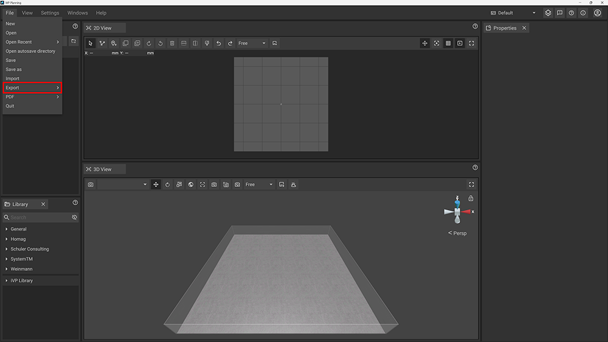
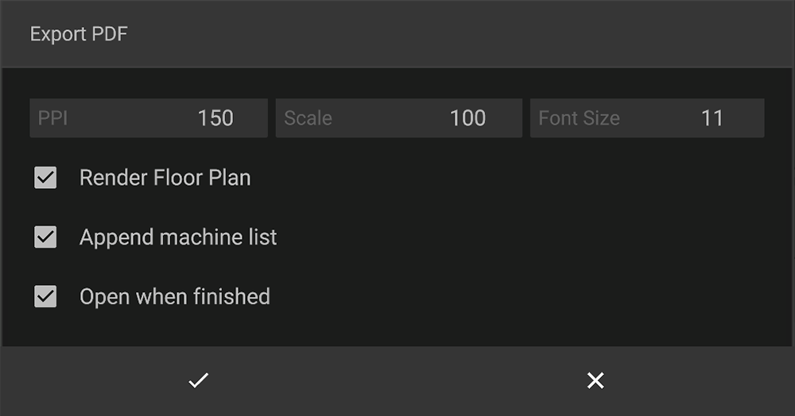

With iVP Planning it is possible to export the 2D View of your currently opened project to a PDF file that can be used for illustration or as a basis for further planning. To do so click on __File__ in the text menu of the top bar, hover over __Export__ and choose __PDF__ from the displayed list.

## Export PDF settings

A new window will open to configure the PDF file and its export process.

### PPI

This value defines the resolution of the exported PDF file.

### Scale

This value defines a scale being applied to the exported PDF file, e.g. 1:100 or 1:50.

### Font size

If the __Append machine list__ option is checked this value will define the font size of the list entries.

### Render ground plan

If this option is checked the PDF [floor plan](../user-interface/the-floor-plan.md) of the project will be rendered during the export process and will therefore be visible in the exported PDF file.

### Append machine list

If this option is checked a list of all machines and objects in the project will be part of the exported PDF file.

### Open when finished

If this option is checked the exported PDF file will be opened with your default PDF viewer right after the export process.