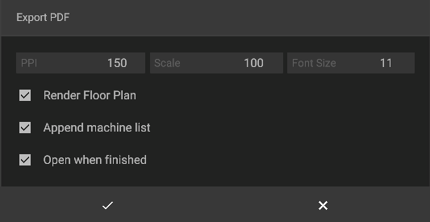

# Exporting PDFs

in iVP it is possible to export the current project as a PDF that can be used for illustration or as a basis for further planning. If desired, the 2D-view of the room or fabric hall can furthermore be complemented by a auto-generated, complete list of all machines and objects.

## Exporting PDFs step by step


How to import and export PDFs (german)


The export process can be started by clicking on **File -> PDF - > Export PDF**.

&#x20;A new window will open that makes it possible to specify how the PDF will be exported. The following adjustments are possible:

* **PPI:** this value defines the resolution of the exported PDF
* **Scale:** this value defines the scale of the PDF to import, e.g. 1:100 or 1:50
* **Font size:** if the "Append machine list" option is checked, this value will define the font size of the list entries
* **Render ground plan:** if checked the PDF [floor plan](../user-interface/the-floor-plan.md) of the project will be rendered during the export and will therefore be visible in the exported PDF
* **Append machine list:** if checked a list of all machines and objects in the project will be appended as separate pages to the PDF (this list will also include the specification of [custom machines](../machines/customizable-machines.md))
* **Open when finished:** if checked the PDF will be opened in the default PDF viewer right after the export process finished

