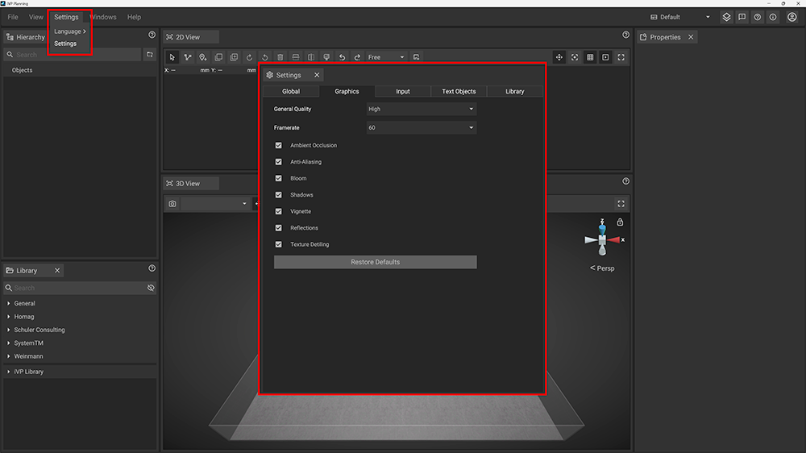
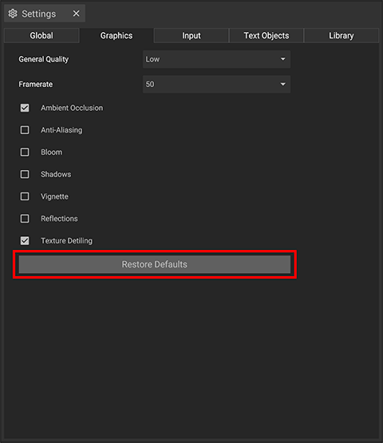

You can customize iVP in [many ways](../settings/graphic-settings-panel.md) to adjust graphical quality and performance. By default the Graphic Settings of iVP Planning are set to high performance to give you a good start. You can quickly check or manually restore them.

## Open the Graphic Settings

To open the Graphic Settings Panel click __Settings__ in the text menu of the top bar and select __Settings__ again. Select the __Graphics__ tab in the new window that has opened to check and adjust your Graphic Settings.

## Restore Defaults

The __Restore Defaults__ button sets back the Graphic Settings to installation default values.


iVP is made for a variety of desktop computers, laptops and tablets. If you do not use a high-end computer system with a dedicated graphic card you might experience performance issues when using specific graphic options. We recommend you to have a closer look at the [Graphic Settings Page](../settings/graphic-settings-panel.md) of this Helpdesk to learn more about the perfect settings for each device or requirement.
