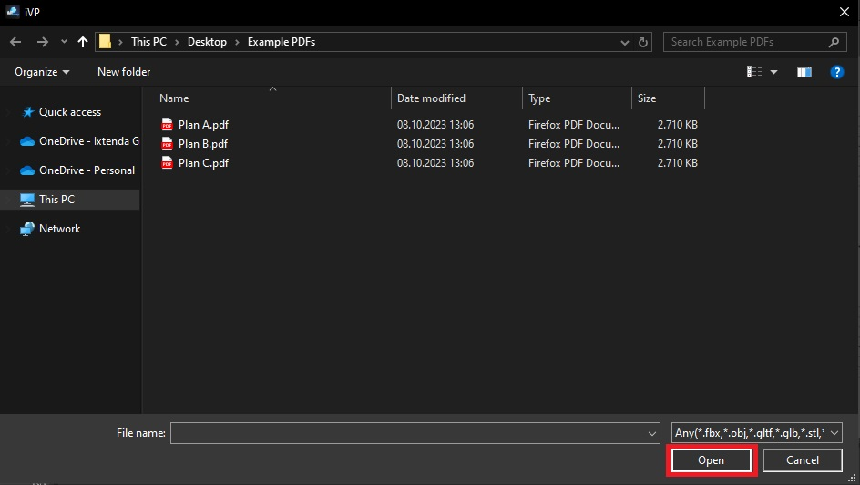

# Importing PDFs

In iVP it is possible to import PDFs that will act as an overlay for the [floor plan](../user-interface/the-floor-plan.md). This can be useful for illustration or when it is necessary to transform a 2D (factory) plan into a 3D scene.

## Importing PDFs step by step:

To import a PDF, click on **File -> Import**. A new window will open that allows you to navigate to the folder containing the PDF you want to import.

As soon as you have found the file, simply double-click on it or select it and click **Open**.

Before iVP actually processes the PDF and imports it, you will be asked to set some parameters that specify how it will be loaded. The options are:

* **Page Size**: Changes the size of the imported PDF, you can either choose from a preset or manually customize the size of the file.

* **Width Original File**: Displays the width of the original file.

* **Scale**: Adjusts the scale of the imported file.

* **Resolution**: Adjusts the resolution of the imported file.

* **Name**: Displays and allows you to change the name of the imported file.

* **Add to Library**: Adds and saves the imported item to your [personal library](../user-interface/library-panel.md).

