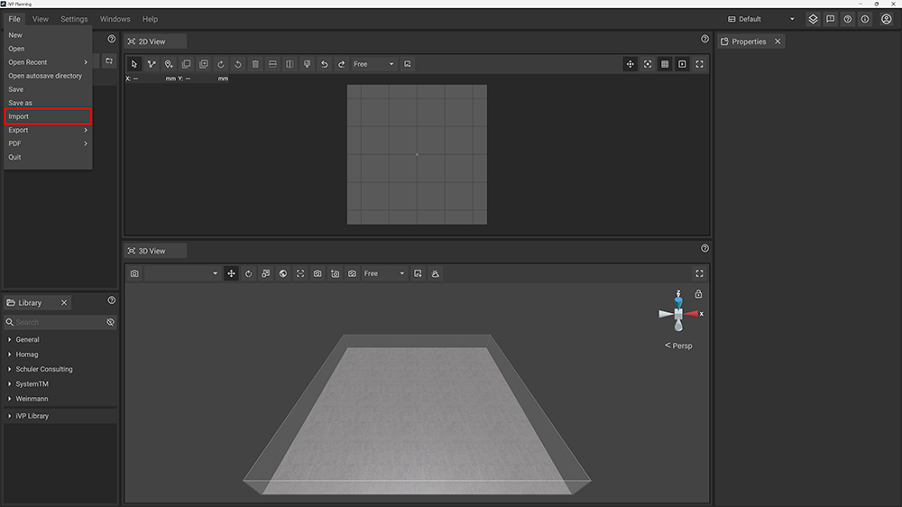
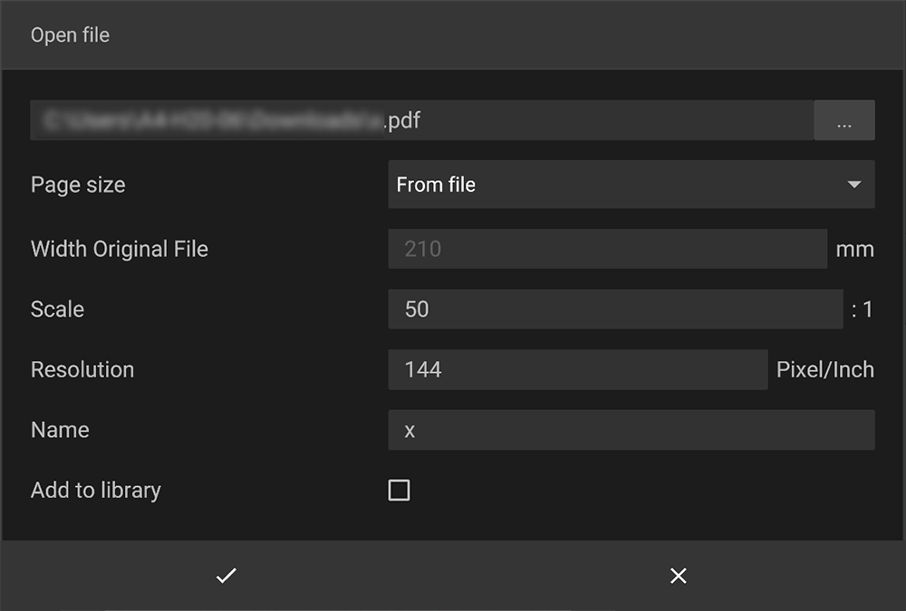

To import a PDF click on __File__ in the text menu of the top bar and choose __Import__. An imported PDF file will be treated as any other object of your project and sorted into the project's hierarchy - meaning it can be selected, manipulated and deleted from there.

## Configure the PDF import

A new window will open to specify the location and additional configurations for the PDF file you want to import.

### Page Size

This option changes the size of the imported PDF file. You can either choose from a preset or provide a custom size for the file. You can also use the dimensions saved within the PDF file.

### Width Original File

This option displays the original width of the given PDF file in mm. It can be adjusted if the file size is not derived from the PDF file itself. In addition you can modify the overall width and scale of the PDF file to be imported.

### Scale

This option adjusts the size ratio of the imported PDF file (e.g. 50:1) so you can proportionately alter its dimensions.

### Resolution
This option adjusts the resolution of the imported PDF file.


Note that a higher resolution creates sharper lines but might impact the performance in a negative way.


### Name

With this option you can modify the name of the imported PDF file that will be used inside the [Hierarchy Panel](../user-interface/hierarchy-panel.md).

### Add to Library

If you check this option the imported PDF file will be saved to your [personal library](../user-interface/library-panel.md).