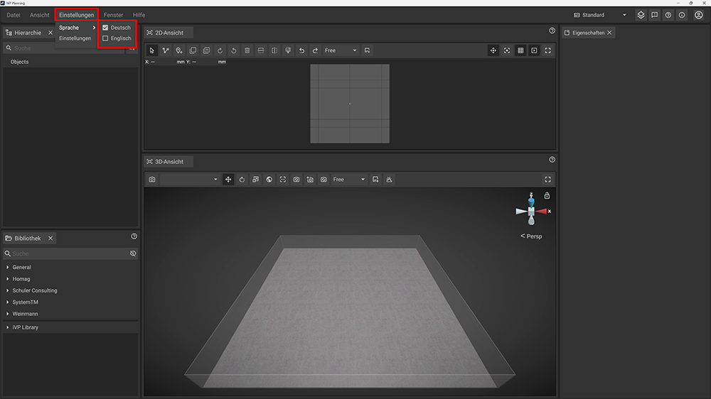

The language of the user interface can be changed by clicking on __Settings__ in the text menu of the top bar, hovering above __Language__ to display the submenu and choosing your preferred language. Currently you can choose between German and English.

