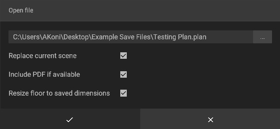

# Loading Projects

In iVP you can load previously [saved projects](saving-projects.md) for continuous work or collaboration. 

## Loading projects step by step:

To load a project click on **File -> Open** and select a file. A new window will open where you can navigate to the folder that contains the project file you want to load.

As soon as you found the file, simply double click or it or select it and click **Open**.


Project files can easily be identified by their **.plan** extension. You can move them to other folders or share them with colleagues or customers, but you should not remove or change their extension.


Before iVP actually processes the data from the file you will be asked to set some parameters that specify how the data will be loaded. The options are:

* **Replace current scene:** if checked iVP will replace the current project with the one stored in the plan.

* **Include PDF if available:** if checked iVP will import the [floor plan](../user-interface/the-floor-plan.md) stored in the save file (if there is one). _This is a legacy option for old save files and might not be applicable to your plan file._  

* **Resize floor to saved dimensions:** adjusts the current [floor plan](../user-interface/the-floor-plan.md#adjusting-the-shape-and-size-of-the-floor-plan) to the floor size stored in the save file


Please note that replacing a scene can result in the deletion of the old scene content. Saved plan files remain untouched, however you will lose unsaved progress.  


