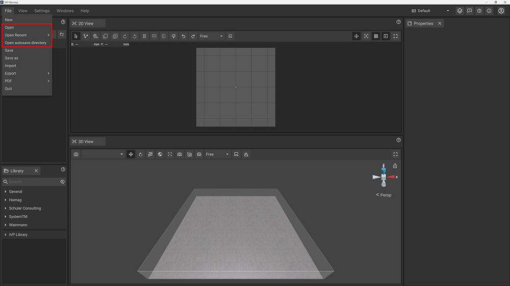
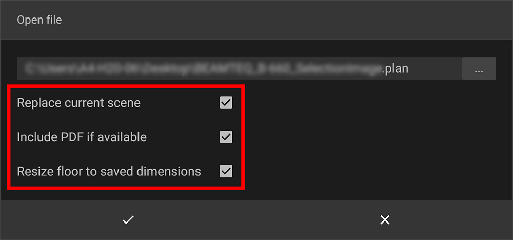

With iVP Planning you can load previously [saved projects](saving-projects.md) to cotinue your work or for collaboration.

## Load your project

A project file can be loaded by clicking on __File__ in the text menu of the top bar and choosing __Open__. A new window of your system's file browser will open to let you choose the project file you want to load.


Project files can easily be identified by their file extension __.plan__. You can move them to other folders or share them with colleagues or customers, but you should not remove or change their file extension.


## Load a recent project

If you want to load a file that you quite recently worked on check the list that displays when you hover the __Open Recent__ option.


iVP Planning regularly creates automated backups of the project file you are currently working on. In case you want to go back to or recover a previous state of your project you should check out the __Open autosave directory__ option.


## Configure the loading process

Before iVP Planning actually processes the data from the file you will be asked to set some parameters that specify how the data will be loaded.

### Replace current scene

If checked iVP Planning will replace the currently opened project and its objects with the ones stored in the plan. Alternatively you can uncheck this option to load your project and its objects next to the currently opened ones.


Please note that replacing a scene results in the deletion of the old scene's content. Saved plan files remain untouched, however you will lose unsaved progress.


### Include PDF if available

If checked iVP Planning will import the [floor plan](../user-interface/the-floor-plan.md) stored as a PDF within the plan file (if there is one).


This is a legacy option for old plan files and might not be applicable to your plan file.


### Resize floor to saved dimensions

If checked the current [floor plan](../user-interface/the-floor-plan.md#adjusting-the-shape-and-size-of-the-floor-plan) will be adjusted to the floor size stored in the plan file to be loaded.