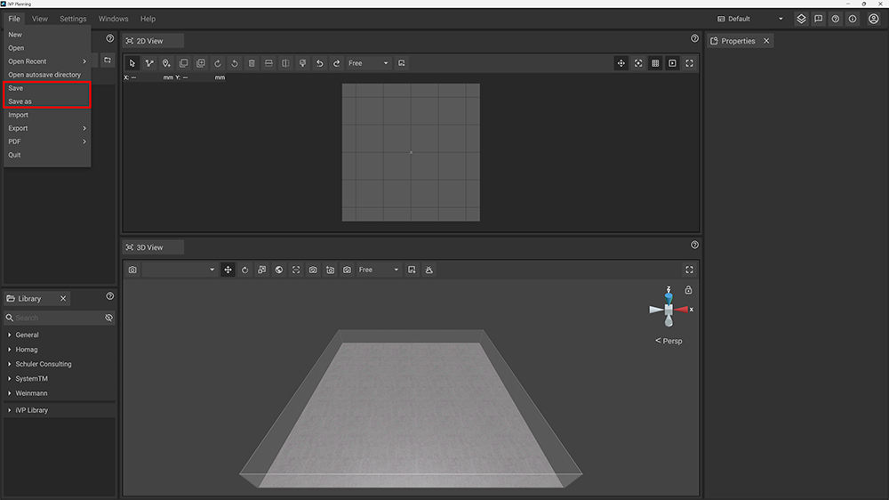

With iVP Planning it is possible to save the current project including all the assets it contains, e.g. [machines](../machines/first-steps-with-3d-object.md), [highlights](../machines/highlighting-objects.md) or the [floor plan](../user-interface/the-floor-plan.md).

## Save your project

A currently opened project can be saved by clicking on __File__ in the text menu of the top bar and choosing __Save__. If the project has never been saved before a new window of your system's file browser will open to let you choose a location and a file name for saving your project.

To save a project that has been saved before always overwrites the old file. If you want to save a copy of the current project without overwriting the already existing project file use the __Save As__ option.


It is also possible to use a [shortcut](../settings/input-manager.md) to save the current project. The default shortcut is __Ctrl + S__.



If you want to share a saved file with colleagues or customers make sure they have the required access rights for the used machines. Machine and object models are __not included__ in the save files themselves!
