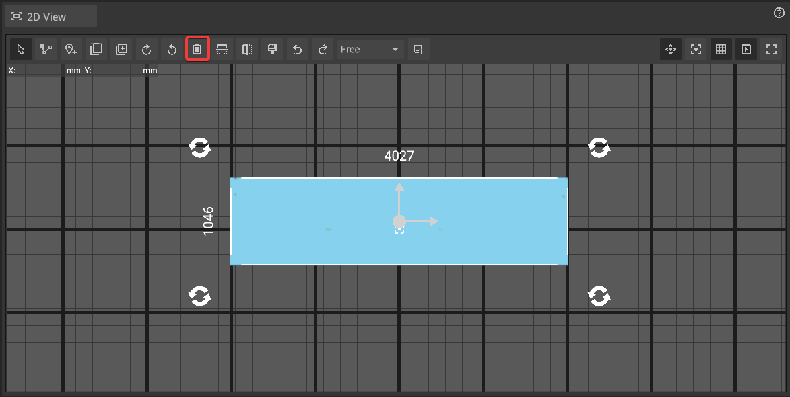
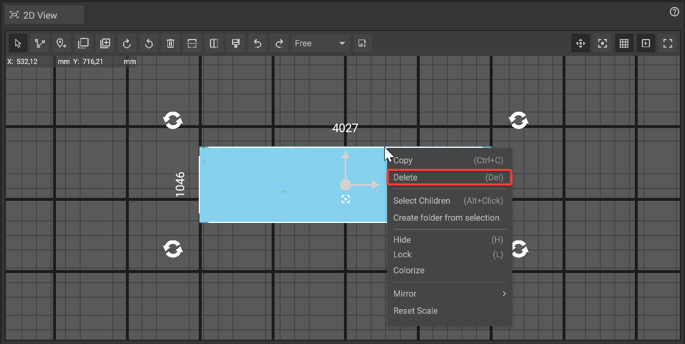
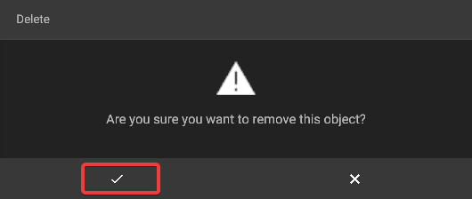

# Delete Objects

In iVP, selected objects can be deleted by either **clicking on the delete icon** located in the [2D-panel toolbar](../user-interface/the-2d-panel.md#the-toolbar-of-the-2d-panel) or by pressing the **Delete key**. Moreover it is possible by **right click on the object** in the 2D-panel and then selecting "Delete" from the appearing context menu.


How to delete objects (german)



Currently there is no way to undo a delete action


Delete object via 2D panel:

Delete object via right click menu:

Confirm removal of the object:

