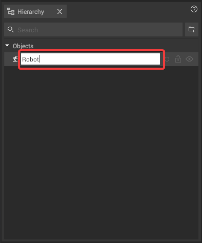
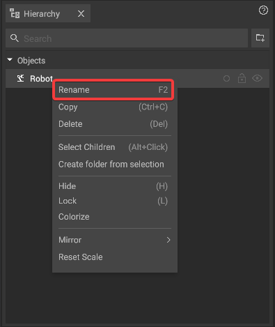

# Renaming Objects And Folders

In iVP Planning, objects and folders can be renamed without limitations concerning name length or special characters like the umlauts "ä", "ü" and "ö".


The name of an object is global - when it is changed in the [hierarchy panel](../user-interface/hierarchy-panel.md) it will also be changed in the [properties panel](../user-interface/the-info-panel.md) and vice versa.


## Renaming objects and folders in the hierarchy panel:

To edit the name of an object or folder [select](../machines/select-objects.md) it and press the **F2** key on your keyboard. The current name in the [hierarchy panel](../user-interface/hierarchy-panel.md) will show a white background which indicates that it can be changed. Type in the new name and press **Enter**.

Alternatively it is possible to **right click on the selected object or folder** in the [hierarchy panel](../user-interface/hierarchy-panel.md) and then selecting **"Rename"** from the appearing context menu, or simply **double-click the object or folder** to rename it directly.

## Rename objects in the properties panel:

To change the name of a [selected object](../machines/select-objects.md) in the [properties panel](../user-interface/the-info-panel.md) click on the **"pen button"** to the right side of the name field and type in the new name.

