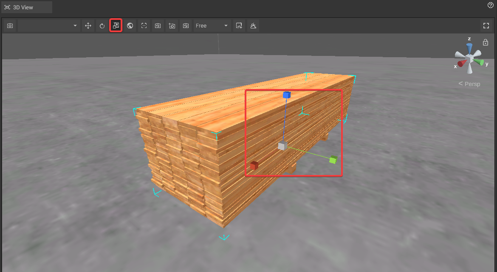
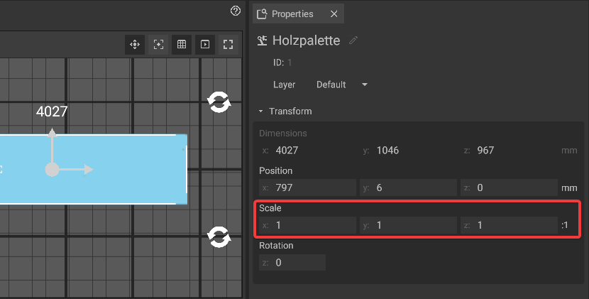

# Scale Objects

The scaling objects offers a way to alter the size of every object. This is useful to make adjustments of objects that are not [customizable](customizable-machines.md).

Exercise caution when modifying scale to prevent distortions or errors. When changing an objects size via it's [customization](customizable-machines.md) options is possible, doing so should be preferred over changing it's scale.   


Keep in mind that scaling along the Z-axis is possible for some, but not most objects at the moment.


## Scaling objects in the 3D-panel:

To scale objects make sure that you switched to the **scaling mode** by clicking on the corresponding button of the [3D-panel toolbar](../user-interface/the-3d-panel.md#the-toolbar-of-the-3d-panel).

As soon as you are in the scaling mode, the handle in the center of the object will change to an angle bracket with three axis which have small cubes at the ends. By **dragging a cube with the mouse** the object will scale in the respective direction. To drag the central cube results in a even scaling of the object in all directions.

## Rotating objects via the properties panel:

It is possible to scale an object via **text input** in the [properties panel](../user-interface/the-properties-panel.md).It allows adjusting object size along the X, Y, and Z axes. A 1:1:1 ratio indicates uniform scaling, with changes reflected in the ratio display.

