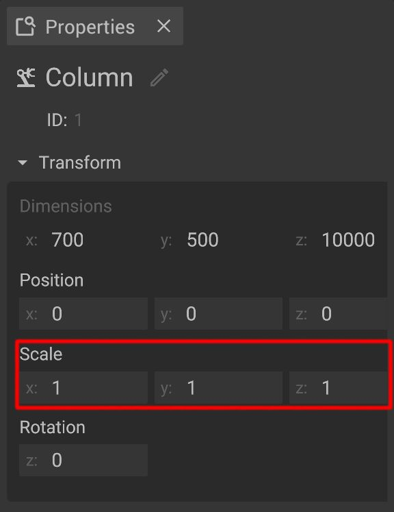

# Scale Objects

Scaling objects offers an easy way to alter the size of every object. This is useful to make adjustments of objects that are not [customizable](customizable-machines.md).


Use the scaling function with care to avoid deformations or glitches. If it is possible to use a [customization](customizable-machines.md) option of the object, always use the option.


## Scaling objects in the 3D-panel:

To scale objects make sure that you switched to the **scaling mode** by clicking on the corresponding button of the [3D-panel toolbar](../user-interface/the-3d-panel.md#the-toolbar-of-the-3d-panel).

As soon as you are in the scaling mode, the handle in the center of the object will change to an angle bracket with three axis which have small cubes at the ends. By **dragging a cube with the mouse** the object will scale in the respective direction. To drag the central cube results in a even scaling of the object in all directions.

## Scaling in the object properties
An object can also be scaled using the input fields in the property window. To do so, select the object you want to edit and unfold the transform section if necessary.


**Please notice:** The number set in the input field is a multiplier for the object's size. 


## Mirroring
[Mirroring](mirror-objects.md) also affects the scale of an object. The mathematical sign of the scale multiplicator determines the orientation of the object. If the sign is negative, the object is mirrored.
You can mirror an object using the corresponding buttons in the [2D view](../user-interface/the-2d-panel.md#the-toolbar-of-the-2d-panel) or the context menu.


## Typical errors
The scaling of machines is to be used with care because it can lead to unpredicted behavior or produce errors. 

### Wrong machine dimension
Changing a machine's size by scaling can lead to wrong machine dimensions. Such a machine won't match the dimensions of the original.

### Skewing
Rotating a child (object that is grouped to another) of a scaled object leads to an effect called skewing. This behavior is no error, but the affected object will be deformed.

### Scaling distances
When a parent (object that has objects grouped to it) is scaled, the distance between this object will increase or decrease depending on the scale multiplier. 
