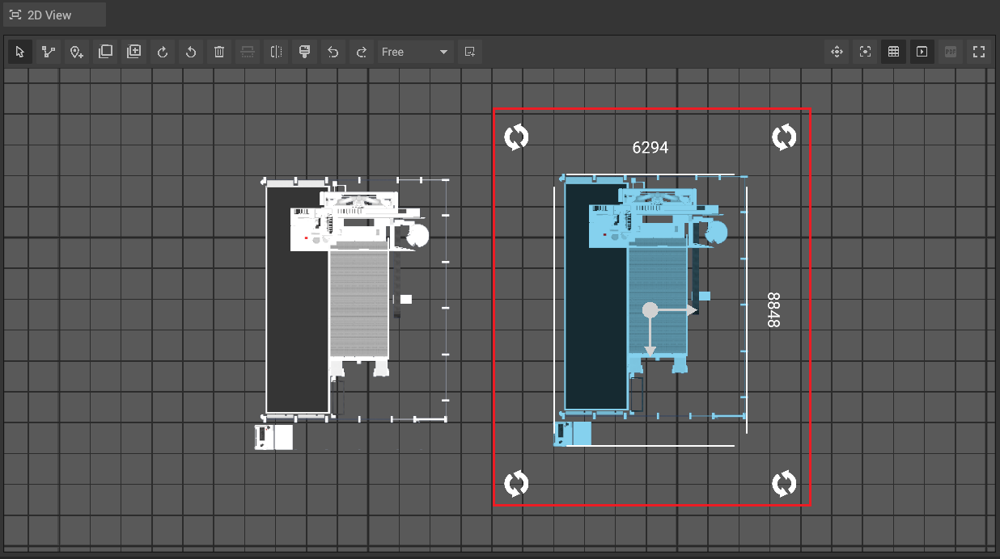
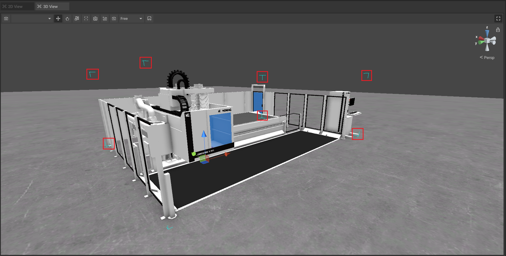
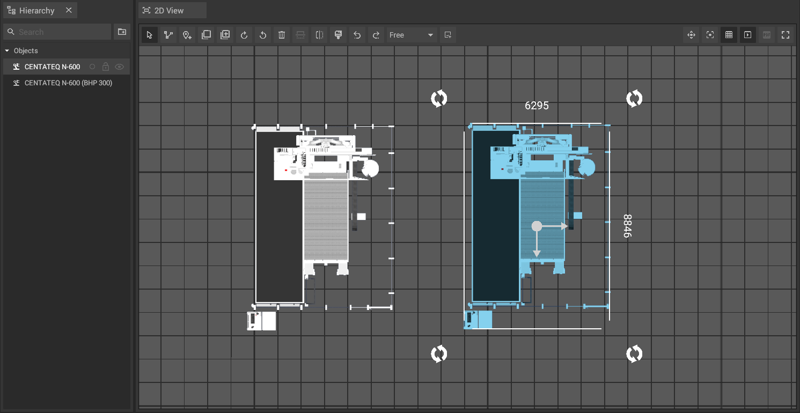
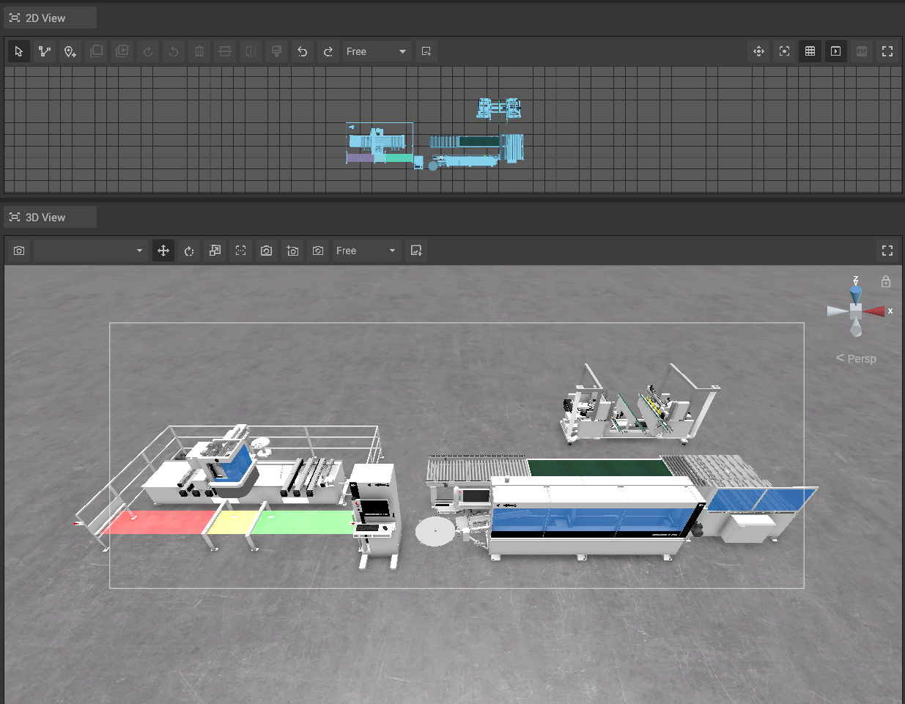
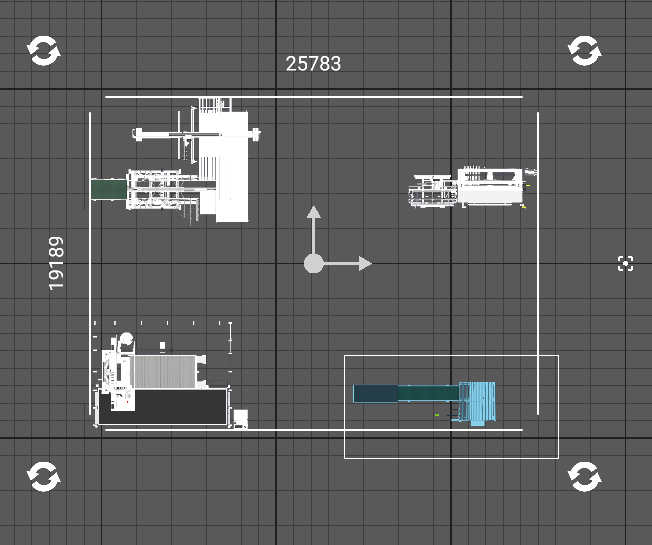

# Select Objects

To interact with objects it is necessary to select them first. Only then it is possible to [move](move-objects.md), [rotate](rotate-objects.md), [scale](scale-objects.md) or [customize](customizable-machines.md) them. To learn more we also recommend to have a look at this iVP YouTube Tutorial.


How to select and move objects (german)


## Selecting Objects in the 2D- and 3D View:

To select an object in the [2D-](../user-interface/the-2d-panel.md) or [3D View](../user-interface/the-3d-view.md) it is sufficient to **click on it**.  

In the [2D-panel](../user-interface/the-2d-panel.md), you can identify selected objects by a blue tint and a white frame around the objects that displays their x- and y-size. Parts of this frame can also be used to [move](move-objects.md#moving-objects-in-the-2d-panel) and [rotate](rotate-objects.md#rotating-objects-in-the-2d-panel) objects in 2D.

In the [3D View](../user-interface/the-3d-view.md), selected Objects will have blue angle brackets around them which form a virtual box. Additionally, a handle will appear in their geometric center which can also be used to [move](move-objects.md#moving-objects-in-the-3D View), [rotate](rotate-objects.md#rotating-objects-in-the-3D View) or [scale](scale-objects.md#scaling-objects-in-the-3D View) objects in 3D.

## Selecting objects via the hierarchy

Every object in the scene also has an entry in the [hierarchy](../user-interface/the-machine-list.md). You can select objects by **clicking on their entry**. The entries of selected machines can be identified by their blue tint.


It is also possible to select multiple objects by holding the **Ctrl** key while clicking on them one after another. You can also use the **Shift** key to select a range of entries at once.


  

## Box Selection

It is also possible to select multiple objects by holding down the **Ctrl** button and dragging your mouse over the objects you want to select.    
    
  

### Additive and Subtractive Selection
  
 When using the Box selection, you can also select objects additively by holding **Ctrl** + **Shift** and dragging your mouse over the object you wish to select.

 Similarly, it is possible to remove objects from your current selection by holding **Ctrl** + **Alt**.

