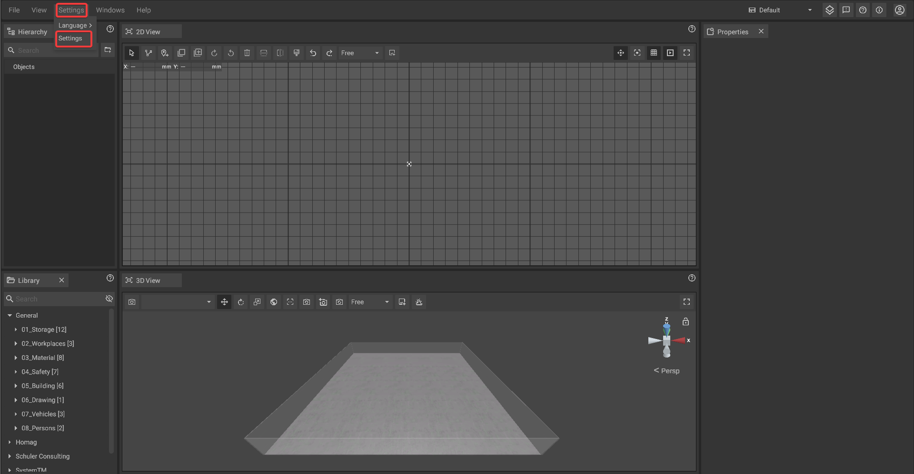
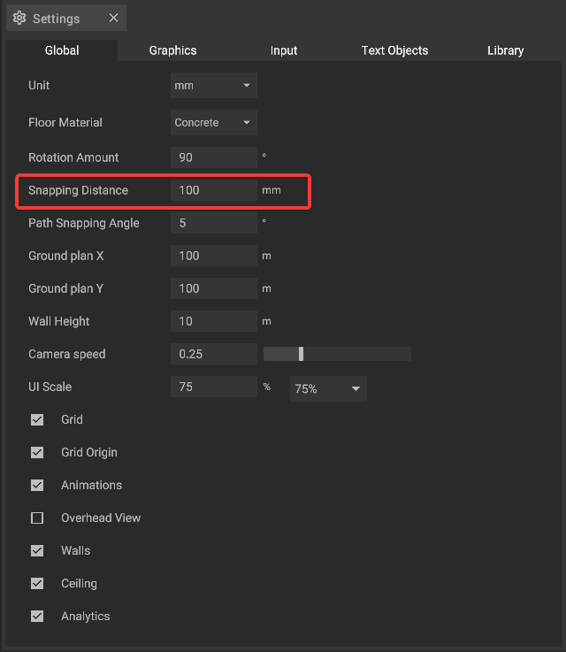

# Snapping

Snapping is a feature that simplifies quick but clean drafts by aligning objects to an invisible grid when they are [moved](move-objects.md). Depending on the snapping distance, objects are moved in increments of this value.

## Changing the snapping distance:

To change the snapping distance first open the [global settings](../settings/global-settings.md) by clicking on the entry in the [text menu](../user-interface/the-top-bar.md#text-menu) or the settings button in the [top bar](../user-interface/the-top-bar.md#icons).

In the [global settings](../settings/global-settings.md) tab you can now **enter a new value** in the "Snapping Distance" field.

