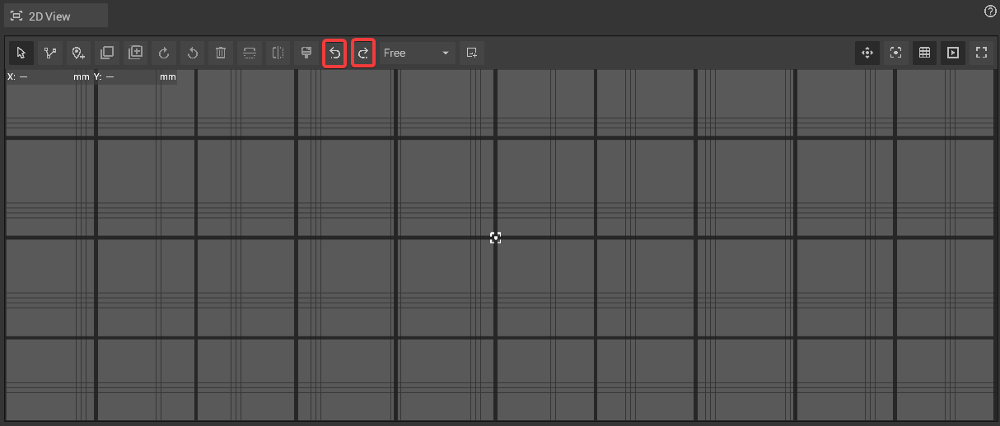

# Undo And Redo

## Undo and Redo via shortcut or button:


Undo/redo currently only supports positions, rotations and scales of objects. All other changes are permanent.


Use the _Ctrl+Z_ keyboard shortcut to undo changes and _Ctrl+Y_ to redo them. Alternatively, it is possible to **click on the redo or undo icon in the toolbar** of the [2D View](../user-interface/the-2d-view.md#the-toolbar-of-the-2D View).

