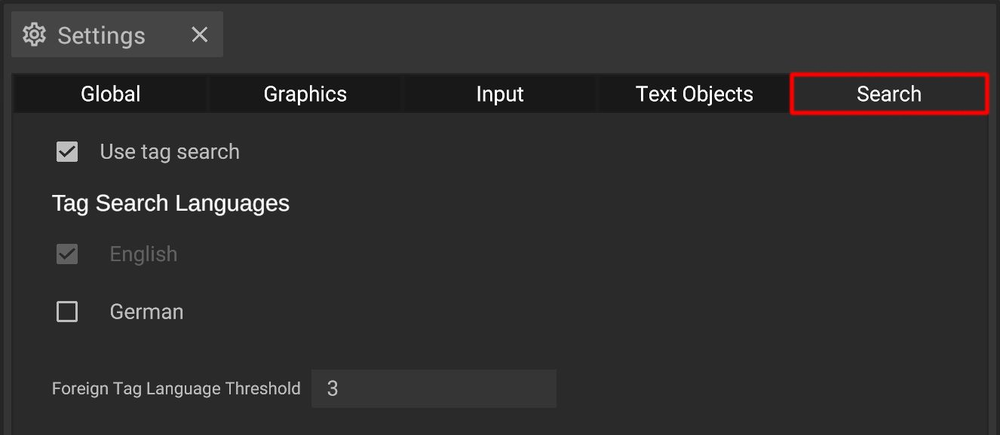

# Search Settings

The search settings offer several global options for the search input field in your [library](../user-interface/machine-database-panel.md). 


The search is used to check the database for specific objects or tags (if applicable).


## The options explained

| Toggle                             | Description                                                                                                                                  |
| ---------------------------------- | -------------------------------------------------------------------------------------------------------------------------------------------- | 
| **Use tag search**                 | Toggles whether to show additional filters based on tags                                                                                     |
| **Tag Search Languages**           | Checked languages will be used by the search (your preferred language will always be checked)                                                |
| **Foreign Tag Language Threshold** | If the tag search has less results (in your preferred language) than defined here, foreign languages are also searched for the searched word |