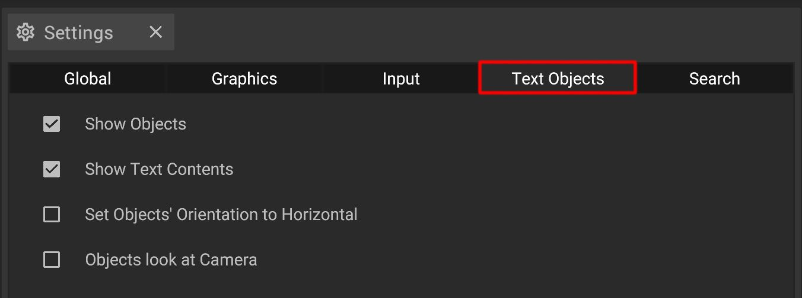

# Text Objects Settings

The graphic settings offer several options to adjust the way text objects are set up globally. 


Textobjects are objects available from the [library](../user-interface/machine-database-panel.md) and are used to help communicate information in your projects.


## The options explained

| Toggle                                     | Description                                                                                                                     |
| ------------------------------------------ | ------------------------------------------------------------------------------------------------------------------------------- | 
| **Show Objects**                           | Toggles the visibility of the 3D object                                                                                         |
| **Show Text Contents**                     | Toggles the visibility of the texts in [2D](../user-interface/the-2d-panel.md) and [3D view](../user-interface/the-3d-panel.md) |
| **Set Objects' Orientation to Horizontal** | Toggles between text as a 3D object or a horizontal "flat" text in the [3D view](../user-interface/the-3d-panel.md)             |
| **Objects look at Camera**                 | Toggles if text will be rotated to be always looking at the camera (only working if not set to horizontal orientation)          |

To change a shortcut, simply click on the gray button on the right side of the respective entry, followed by the key you want to use as new shortcut.

To save a custom layout of shortcuts globally, press the "save" button and your changes will be also available when you start iVP the next time.

